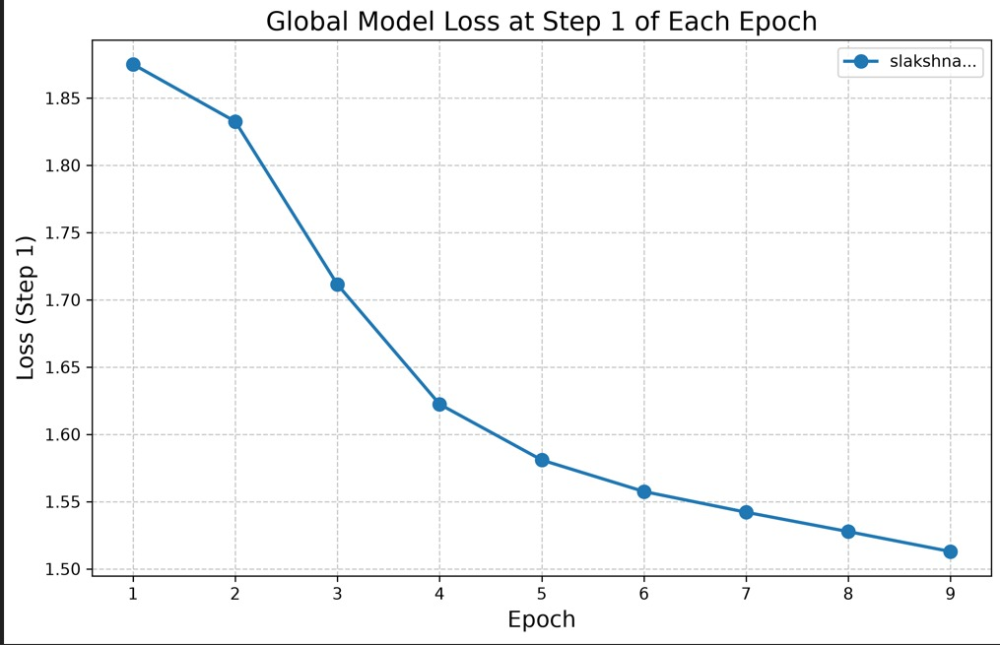
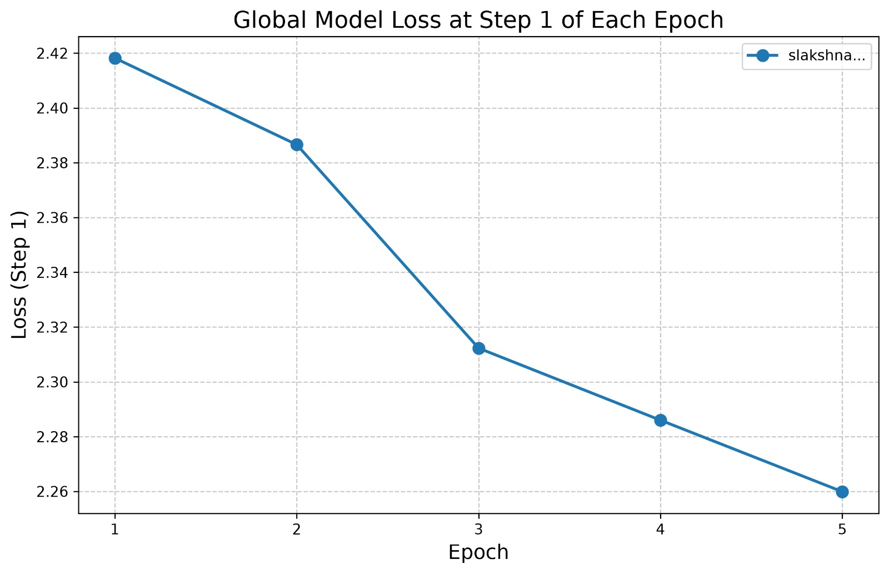

# Slakshna Cross-Country Joint Training Report

**Experiment date:** 14 August 2026  
**Reporting date:** 17 August 2026  
**Scope:** Joint integration exercise between the Australian and Indian teams

## Executive Summary

The joint exercise brought two independently operated Slakshna nodes into the
same cross-country Iroh Gossip mesh and ran real TinyLlama LoRA fine-tuning at
both sites. The Australian node remained connected to the Indian endpoint for
approximately 41 minutes, received four complete remote delta messages, and
successfully decoded the most recent Indian update. The Australian node
completed eight 50-step local training rounds and began a ninth; the Indian
delta metadata and loss curve show that the Indian node reached Round 5 before
it was stopped. Both local loss curves decreased during the session.

The exercise therefore validated public-Internet peer connectivity, sustained
Gossip operation, bidirectional participation in a common federation, real
local training, and transport-level serialization and decoding of model
updates. It did not, however, validate effective cross-site parameter
aggregation. Post-run inspection found that Australia trained a rank-8 LoRA
adapter while India sent rank-16 LoRA deltas. All 88 corresponding tensor names
were present, but all 88 shapes differed. The current receiver accepted the
remote payload because it passed format, finite-value, and norm checks; the
aggregator then silently skipped every incompatible tensor. Consequently, the
loss reduction at each site is evidence of local learning, not evidence that
the other site's update influenced its model.

This distinction is the principal result of the exercise. The network and
delta transport path worked, but a configuration mismatch and insufficient
schema enforcement prevented the run from becoming a valid federated model
fusion experiment.

## Framework Architecture and Training Flow

Slakshna divides responsibility between a Rust orchestration layer and a Python
machine-learning layer. The Rust process owns the persistent node identity,
peer discovery, Iroh QUIC/Gossip transport, the federation clock, update
history, peer reviews, and the HTTP and WebSocket interfaces. The Python ML
engine prepares a node-specific Bhaskera configuration, tokenizes data when a
cache is unavailable, launches Ray workers for distributed training, extracts
the learned LoRA delta, compresses it, loads cached peer deltas, performs local
aggregation, and saves the adapter used to initialize the next round. The
managed UDP ingress used in this exercise only made the Iroh endpoint reachable
across institutional network boundaries; it did not participate in the
learning algorithm.

One local federated cycle follows the sequence below.

```text
Wait for the next wall-clock federation boundary
                         |
                         v
Stage each known peer's most recent update from Gossip history
                         |
                         v
Launch Bhaskera and train locally for a fixed number of optimizer steps
                         |
                         v
Compute local LoRA delta = trained adapter - previous LoRA base
                         |
                         v
Clip, add error feedback, sparsify, and INT8-quantize the local delta
                         |
                         v
Decode and validate the staged peer deltas
                         |
                         v
Compute the locally weighted aggregate and save the next LoRA base
                         |
                         v
Broadcast this node's own compressed delta and peer reviews over Gossip
                         |
                         v
Apply the participant/deadline barrier, rank peers, and await the next boundary
```

The update broadcast by a node is its own compressed local delta, rather than
the aggregate it has just constructed. Each receiver independently combines
its own new delta with the most recent peer deltas available in its local
history. As a result, two peers can construct different next-round bases when
they have different update histories, weights, configurations, or timing.
There is no central aggregation server that publishes one authoritative global
checkpoint.

### Time and round semantics

The release used in this exercise is primarily wall-clock driven. Each node
computes the next UTC timestamp divisible by `epoch_duration_secs`, sleeps
until that boundary, and then invokes one local training job. In the Australian
configuration the boundary interval was 300 seconds and each invocation was
limited to 50 optimizer steps. The word *epoch* in the runtime log and loss CSV
therefore identifies a federated invocation; it does not mean one complete
pass over the 9,846-example tokenized dataset.

There is no mode in this release that exchanges an update after a configured
number of dataset epochs, and nodes do not wait until they share the same round
counter. A slow node can train across one or more clock boundaries and then
join the next future boundary, while a faster node may execute more local
rounds in the same wall-clock interval. Gossip delivery is asynchronous. The
receiver stages the latest update known for each peer at the beginning of its
next local round, regardless of whether that update was produced in the same
round. Although the compressed envelope carries a sender-side round number,
the current aggregation path does not use it to reject stale, future, or
out-of-round updates. A disconnected peer's last update can therefore be
reused by later local rounds.

`expected_peers` and `sync_deadline_secs` implement a limited post-training
barrier. The implementation counts participants represented in local history;
it does not count fresh updates for the current round. It also checks the
deadline only after local training and broadcast preparation. In this run the
deadline was 100 seconds after each epoch boundary, while a warm Australian
training round took roughly 172 seconds. The deadline had therefore already
passed when it was checked, producing the repeated warning that execution was
continuing with two participants. These warnings were also expected because
`expected_peers` was configured as three although only two nodes participated.

### Delta construction, transport, and aggregation

For LoRA fine-tuning, the Python engine loads the previous aggregated adapter
as the next training base and calculates a tensor-wise difference after local
training. It applies a global L2 norm cap of 100. The configured noise
multiplier was zero, so this should be described as clipping rather than an
active differential-privacy guarantee. The engine then adds the residual left
by the previous round's lossy compression. This error-feedback mechanism is
intended to allow omitted information to re-enter a later update.

Compression is performed independently for every floating-point tensor. The
encoder deterministically retains approximately the largest 10% of values by
absolute magnitude, stores their flattened INT32 indices, and quantizes the
selected values with symmetric INT8 quantization and one scale per tensor. The
versioned envelope also records tensor shapes, the logical sender, and the
sender's local round. It is serialized with PyTorch, Base64 encoded, embedded
inside a hash-chained Slakshna `ModelUpdate`, and broadcast on the federation's
Iroh Gossip topic.

The decoder enforces format and version fields, payload and tensor limits,
index validity, finite scales, and the expected quantizer before reconstructing
dense FP32 tensors. The ML engine subsequently rejects NaN/Inf values and
remote deltas whose total norm exceeds 10. In this release, however, this
validation does not compare the received tensor schema with the local adapter
schema. Schema compatibility is considered only inside the weighted-sum loop,
where incompatible tensors are skipped without an error.

Aggregation is not conventional sample-weighted FedAvg. Every node maintains
local `alpha` values, converts them to weights with a softmax, and computes a
weighted sum of the locally available deltas. Afterward it compares local and
peer deltas with cosine similarity and adjusts the alpha values using
`trust_beta`. Peer reviews are broadcast and accumulated into a trust ranking,
from which the four highest-ranked peers form a reported cohort. In the current
implementation cohort membership is informational: it changes the status log
but does not gate subsequent training, broadcast, or aggregation.

## Joint Exercise Configuration

The Australian node ran the tagged release source at commit
`9f93ec45ae0d3eb9c901aff3b50d4325b5050488`. The exact Indian source revision,
hardware allocation, random seed, and complete effective configuration were
not retained with the Australian artifacts. Values confirmed from the local
configuration and received delta are separated from unknown remote values
below.

| Configuration item | Australian node | Indian node / received update |
|---|---|---|
| Base model | `TinyLlama/TinyLlama-1.1B-intermediate-step-1431k-3T` | TinyLlama tensor schema observed; exact revision not recorded |
| Dataset | `timdettmers/openassistant-guanaco` | Reported as the shared dataset; effective data state not independently audited |
| Available examples | 9,846 tokenized records from a 10,000-record cap | Not recorded |
| Sequence length | 512 | Intended to be 512; not independently audited |
| Precision | BF16 training | Not recorded |
| LoRA targets | `q_proj`, `v_proj` | Same 88 tensor names observed |
| LoRA rank | 8 | **16, confirmed from every received tensor shape** |
| LoRA alpha / dropout | 16 / 0.05 | Not recoverable from the delta |
| LoRA parameter count | 1,126,400 across 88 tensors | 2,252,800 across 88 tensors |
| Local batch / accumulation | 4 / 2 | Not recorded |
| Optimizer / peak learning rate | AdamW / `1e-4` | Not recorded |
| Local budget per invocation | 50 optimizer steps | Curve and payload reach Round 5; per-round steps not independently audited |
| Local distributed execution | Two Ray DDP workers | Not recorded |
| Federation boundary | 300 seconds | Not recorded |
| Sync deadline | 100 seconds from boundary | Not recorded |
| Expected participants | 3 configured; 2 observed | Not recorded |
| Delta sparsity / quantization | Top 10% per tensor / symmetric INT8 | Top 10% and symmetric INT8 confirmed from received envelope |
| Peer transport | Iroh QUIC/Gossip through managed UDP ingress | Compatible Iroh QUIC/Gossip peer |

For each completed Australian round, the dense FP32 LoRA delta represented
4,505,600 bytes. Sparsification retained 112,596 values. The serialized binary
envelope was approximately 615 KB, and Base64 expansion produced an 820,268-byte
payload; the complete Gossip message was approximately 820,677 bytes. This was
about 5.5 times smaller than the dense FP32 representation at the wire-payload
level. The latest Indian delta contained 225,214 selected values and produced a
1,570,756-byte Base64 payload. Its near-twofold size was consistent with its
rank-16 adapter containing twice as many parameters.

## Execution Timeline and Communication Evidence

The Australian launcher started at approximately 19:18 local time. Its Iroh
mesh reported the Indian endpoint as a neighbor within a few seconds. The first
Australian federated boundary occurred at 19:20. The local node completed eight
rounds and broadcast eight full compressed updates before the Indian endpoint
left the Gossip mesh at 19:59:55. Australia then began a ninth invocation at
20:00 and was stopped later, after logging 49 of its planned 50 steps.

Four complete rank-16 Indian model-update payloads arrived locally at
approximately 19:27, 19:36, 19:46, and 19:56. The latest persisted envelope
identifies itself as Indian Round 5, which agrees with the five points in the
Indian loss curve. The available local evidence does not establish why no
Round-1 payload appears in the Australian receive log; it may have been
produced before the relevant Gossip subscription was ready. Indian-side logs
would be required to determine that precisely. The Indian team stopped its
node first, while the Australian node continued briefly, explaining why the
two sites recorded different numbers of local invocations.

| Observed event | Result |
|---|---|
| Cross-country peer discovery | Successful; Indian endpoint joined the Australian Gossip mesh |
| Sustained mesh lifetime | Approximately 41 minutes before the Indian peer disconnected |
| Complete Australian local rounds | 8, each with 50 optimizer steps |
| Additional Australian work | Round 9 reached step 49 before interruption |
| Indian round evidence | Received envelope records Round 5; curve contains five round starts |
| Australian full model-update broadcasts | 8 payloads of approximately 0.78 MiB each |
| Indian full model-update receives | 4 payloads of approximately 1.50 MiB each |
| Remote envelope decoding | Successful |
| Remote finite-value and norm validation | Successful |
| Remote tensor schema compatibility | Failed: 88 of 88 common tensors had different shapes |
| Effective Indian contribution to Australian weighted sum | None; all incompatible tensors were skipped |
| Clean coordinated termination | Not performed; India stopped before Australia |

## Training-Loss Results

The supplied plotting script selects the row where `step == 1` from every
locally numbered invocation. Despite the plot title, this is a local
single-batch training loss, not a global loss evaluated on a common validation
set. Absolute values should not be compared directly across sites because the
batch contents, shuffle order, distributed layout, random state, adapter rank,
and effective model state can differ. The curves are useful as evidence that
each local training process was progressing, but they cannot demonstrate that
the two nodes converged to a common model.

| Site | Plotted invocations | First step-1 loss | Last step-1 loss | Relative reduction |
|---|---:|---:|---:|---:|
| Australia | 9 | 1.8751 | 1.5129 | 19.3% |
| India | 5 | approximately 2.418 | approximately 2.260 | 6.5% |

The Australian CSV contains 449 rows: eight complete 50-step rounds and 49
rows from the interrupted ninth round. Across the eight complete rounds, mean
per-step loss decreased from 1.7588 to 1.5643, an 11.1% reduction. The
round-ending score reported by the ML engine decreased from 1.8330 to 1.7016.
These metrics describe the Australian training trajectory before a held-out
evaluation and should not be presented as validation loss.

### Australian node



### Indian node



The difference in scale is not, by itself, evidence of an algorithmic error:
each point represents one locally sampled batch. The post-run delta inspection
does, however, establish that the sites were not training the same adapter
contract. The rank-8/rank-16 mismatch is therefore an additional concrete
reason not to interpret the two lines as measurements of one shared global
model.

## Compatibility Finding and Claim Boundary

The local rank-8 adapter and the last received rank-16 envelope contained the
same 88 parameter names, confirming that both targeted TinyLlama query and
value projection adapters. Their parameter counts differed exactly by a factor
of two. Every `lora_A` and `lora_B` tensor carried rank in one dimension, so
none of the received shapes matched its local counterpart.

The receiver logged that the network delta had been “successfully verified and
applied” after decoding and norm validation. The actual aggregation function
first allocated its output tensors from the local delta, then added another
tensor only when its shape equaled the existing output shape. It produced no
warning or failure for a mismatch. Because the local delta is inserted first,
all 88 Indian tensors were skipped. The persisted trust state could still list
the Indian node, and the Rust layer could still place both nodes in the trusted
cohort, but neither fact demonstrates numerical participation in the adapter
update.

Accordingly, this run supports the following claims:

- independently operated cross-country nodes can discover one another and
  sustain an authenticated Iroh Gossip connection through public UDP ingress;
- both sites can execute real local LLM fine-tuning for multiple rounds;
- Slakshna can broadcast, receive, deserialize, and perform basic safety checks
  on versioned sparse-INT8 LoRA delta envelopes across sites; and
- the loss and model artifacts required for post-run analysis are produced.

It does not support the claim that the sites constructed a common global
adapter, that either site's loss reduction resulted from the other site's
training, or that the current runtime rejects incompatible participants before
training begins.

## Conclusion and Minimum Follow-Up

The exercise was a successful cross-country systems-integration and transport
test, but an incomplete federated-learning validation. It demonstrated that
the native Slakshna release can establish a real international peer mesh, keep
both local trainers active, and exchange structurally valid compressed model
messages without a shared filesystem or central coordinator. The investigation
also showed why connectivity and a `peer_delta_loaded` event are insufficient
acceptance criteria for federated training.

A minimal repeat does not require a larger experiment. Both teams should first
use one shared effective model contract, including base-model revision, LoRA
rank and targets, tensor schema, sequence length, and compression settings.
The runtime should compare a contract or tensor-schema fingerprint before
training and fail a received update when any name or shape differs. It should
also distinguish “decoded,” “schema-compatible,” and “numerically aggregated”
events, and should bind update freshness to a declared federation-round policy
if synchronized rounds are intended. With those checks in place, a short
two-round rerun would be sufficient to determine whether both nodes construct
the same aggregated adapter and whether remote learning actually affects the
next local initialization.
