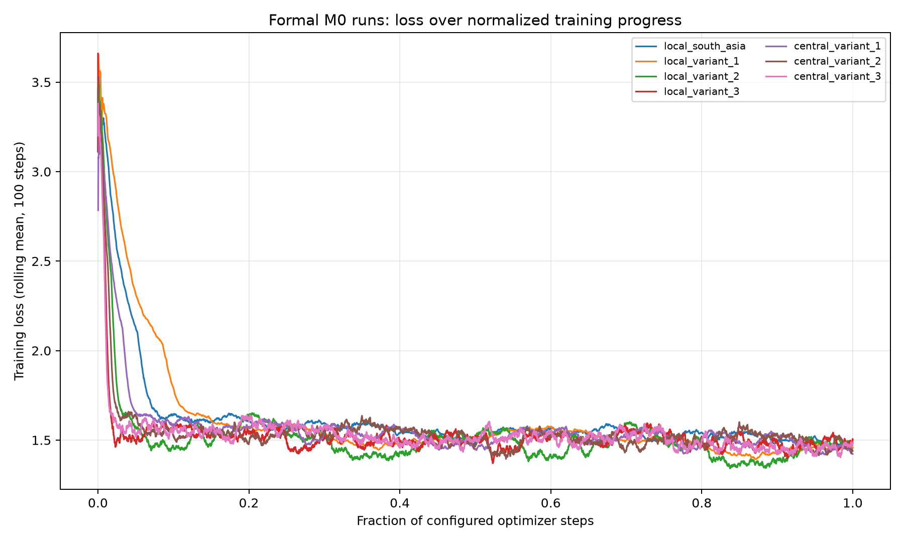
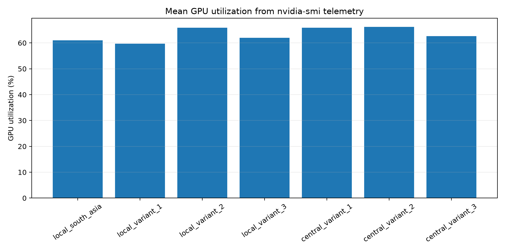
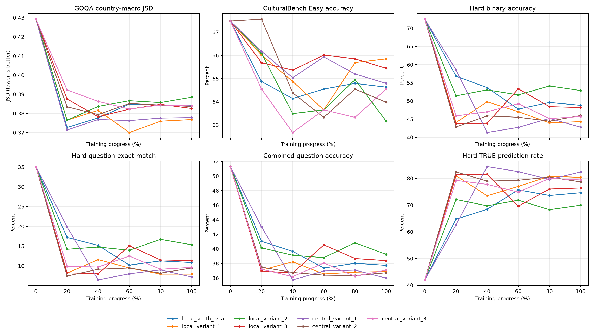

# M0 Local and Centralized Baseline Training Report

**Reporting date:** 21 August 2026

**Scope:** OLMo 2 7B cultural adaptation baselines and checkpoint-trajectory evaluation

## Executive summary

This work establishes the first complete set of local-only and centralized reference models for the M0 cultural adaptation study. Seven LoRA adapters were trained from the same OLMo 2 7B Instruct base and the same adapter initialization. Four runs used individual regional views, while three centralized runs used the South Asian data together with one of the three candidate Australian-side views. Every run completed the planned two data epochs, produced a recoverable final checkpoint and an independently loadable final adapter, and showed lower average loss in the second epoch than in the first.

The final adapters and the unmodified base model were evaluated on CulturalBench-Easy, CulturalBench-Hard, and GlobalOpinionQA. We then extended the same evaluation to checkpoints at approximately 20%, 40%, 60%, and 80% of every training run. The resulting grid contains the base model and 35 trained model states. Each state was scored on 1,227 CulturalBench-Easy questions, 4,908 CulturalBench-Hard judgments, and 2,556 GlobalOpinionQA questions under five deterministic option-order prompts. All 36 states completed with full coverage, no unparseable CulturalBench response, and valid GlobalOpinionQA probability distributions.

The result is mixed rather than a general improvement over the base model. Under the more robust five-prompt GlobalOpinionQA protocol, fine-tuning reduced the country-macro Jensen–Shannon distance from 0.4292 for the base model to 0.3768–0.3885 for the seven final adapters. The same final adapters lost between 1.6 and 4.3 percentage points on CulturalBench-Easy and performed much worse on CulturalBench-Hard. Inspection of the Hard predictions found a strong tendency to answer `TRUE`, rather than a formatting failure. Intermediate checkpoints show that the trade-off appears early and is not monotonic: several runs achieved their best overall balance near 20–60% progress, while continued training often strengthened the Hard-set affirmative bias without a corresponding GlobalOpinionQA gain.

These runs are baselines for later federated experiments; they are not themselves federated runs. They therefore support comparisons among the base model, local-only adaptation, and centralized adaptation, but they do not yet measure the gap between federated and centralized training.

## Experimental design

The base model was `allenai/OLMo-2-1124-7B-Instruct`. Training used the Bhaskera training path in Slakshna with two-process data-parallel execution. Each formal run started from a byte-identical rank-16 LoRA adapter generated with seed 20260820. The model remained in BF16 and the adapters targeted only the query and value projections. The seven runs differed only in their training data and the number of optimizer steps implied by two passes over that data.

### Training data

The training views were prepared from the continent partitions supplied by the data team. Experiment code selected the required countries and combined partitions without semantic cleaning or content deduplication. Benchmark records were kept separate from all training views. The first three local variants represent progressively broader candidate data mixtures; each centralized variant is the union of South Asia and its matching local variant.

| Run | Training view | Records |
|---|---|---:|
| Local South Asia | South Asia | 15,331 |
| Local V1 | Australia and New Zealand | 9,337 |
| Local V2 | Australia, New Zealand, and Western Europe | 45,047 |
| Local V3 | Australia, New Zealand, United States, Canada, and United Kingdom | 89,910 |
| Central V1 | South Asia plus Local V1 | 24,668 |
| Central V2 | South Asia plus Local V2 | 60,378 |
| Central V3 | South Asia plus Local V3 | 105,241 |

The complete training views were tokenized before training with the OLMo 2 Instruct chat template. A common sequence length of 1,024 was used because it retained 98.40–99.70% of source tokens across the seven formal views while truncating only 0.78–2.52% of records. The current native non-packed SFT path pads every example to the fixed length and predicts every non-padding transcript token, including the system and user portions, rather than applying loss only to assistant tokens. This behaviour was held constant across all runs and is important when interpreting both the training loss and downstream results.

### Model and optimizer configuration

| Item | Setting |
|---|---|
| Base model | OLMo 2 1124 7B Instruct |
| Precision | BF16 |
| Attention and kernels | Flash Attention 2; Liger kernels enabled |
| Adaptation | LoRA, no quantization |
| LoRA rank / alpha / dropout | 16 / 64 / 0.03 |
| LoRA target modules | `q_proj`, `v_proj` |
| Initial adapter | Shared initialization, seed 20260820 |
| Sequence length | 1,024 tokens, fixed padding, no packing |
| Distributed execution | Two data-parallel workers |
| Per-device batch / gradient accumulation | 2 / 4 |
| Effective global batch | 16 examples per optimizer step |
| Training duration | 2 data epochs |
| Optimizer | AdamW |
| Peak learning rate / weight decay | `1e-4` / 0 |
| Schedule | Cosine decay with 3% warmup |
| Gradient clipping | 1.0 |
| Evaluation during training | Disabled; evaluation performed offline |

Adapter-only snapshots were retained throughout each run, with approximately 24–26 points over the two-epoch trajectory and an exact final-step snapshot. Full distributed recovery state was retained at epoch boundaries. This gave us both a lightweight inference artifact and a recoverable training state without duplicating a merged 7B model at every checkpoint.

## Training results and efficiency

All seven runs completed their configured step budget. The curves have different numbers of optimizer steps because the datasets differ in size, so Figure 1 uses the fraction of configured progress on the horizontal axis. The rolling loss fell quickly during the opening part of training and then settled around 1.4–1.6. More importantly, the average loss in epoch 1 was lower than in epoch 0 for every run. There was no divergence or late loss spike that would justify discarding a final adapter.

| Run | Steps | Epoch 0 loss | Epoch 1 loss | Final rolling-100 loss | Duration (h) | Mean GPU utilization | Active samples |
|---|---:|---:|---:|---:|---:|---:|---:|
| Local South Asia | 1,916 | 1.6300 | 1.5253 | 1.4565 | 1.22 | 61.1% | 70.8% |
| Local V1 | 1,166 | 1.6172 | 1.4892 | 1.4585 | 0.77 | 59.7% | 68.6% |
| Local V2 | 5,630 | 1.5399 | 1.4640 | 1.4824 | 3.49 | 65.9% | 74.8% |
| Local V3 | 11,238 | 1.5381 | 1.4952 | 1.5026 | 6.95 | 62.0% | 71.4% |
| Central V1 | 3,082 | 1.5882 | 1.5048 | 1.4228 | 1.93 | 65.8% | 74.7% |
| Central V2 | 7,546 | 1.5706 | 1.4983 | 1.4394 | 4.66 | 66.2% | 75.4% |
| Central V3 | 13,154 | 1.5568 | 1.4923 | 1.4732 | 8.13 | 62.7% | 72.0% |

The durations scaled approximately with optimizer-step count, ranging from 0.77 hours for Local V1 to 8.13 hours for Central V3. Mean utilization was between 59.7% and 66.2%, while the 95th percentile was 99% for every run. Between 68.6% and 75.4% of telemetry samples were at or above 10% utilization. This is consistent with a workload that drives both devices strongly during training but still includes data, synchronization, checkpoint, and start/stop intervals. The larger views were not associated with a clear deterioration in utilization.

The final single-step loss is not used to rank models because it is sensitive to the last micro-batch. The epoch averages and rolling-100 values are more stable summaries. Even these training metrics should not be treated as model selection metrics: Local V3 and Central V3 reached low final-step losses, but neither was the strongest model across the downstream evaluations. The held-out results below are the more relevant evidence.

## Evaluation protocol

CulturalBench-Easy contains 1,227 four-option cultural knowledge questions. The model was instructed to return one option letter, and exact multiple-choice accuracy was calculated overall and for Australia/New Zealand, India, and the rest of the world. The regional subsets contain 26, 46, and 1,155 questions respectively. These uneven sample sizes make the overall result much more stable than the two small regional percentages.

CulturalBench-Hard reformulates the same 1,227 questions as four proposed-answer judgments per question, producing 4,908 `TRUE`/`FALSE` decisions. We report per-judgment binary accuracy, exact match across all four judgments belonging to a question, and reconstructed multiple-choice accuracy when the model marks exactly one option as true. This form tests discrimination and response calibration in addition to cultural knowledge.

GlobalOpinionQA contains 2,556 survey questions from the Global Attitudes Survey and World Values Survey. Each question was evaluated under five deterministic prompt variants: the original option order and four SHA-256-seeded option permutations. The five distributions were mapped back to source option order and averaged before comparison with the country-level human distributions. This reduces sensitivity to option position while retaining the original question and answer choices. First-token logits over the listed option letters were normalized into a model answer distribution and compared with the human distributions using base-2 Jensen–Shannon distance. Lower values are better. After excluding 85 source distributions with zero total responses, the evaluation included 46,244 country-question pairs across 138 countries. The primary value in this report is the macro-average over countries, so countries with more available questions do not dominate the result. The India subset is represented by Global Attitudes Survey records; the available World Values Survey portion contains no India entries.

All evaluations loaded LoRA adapters directly on the unchanged base model. No adapter was merged into a separate full-model package. The same prompts, parsing rules, dataset files, and inference settings were used for the base model and all 35 retained adapter checkpoints.

## Overall evaluation results

The table below summarizes the primary metric from each benchmark at the final checkpoint. CulturalBench accuracy is higher-is-better, while GlobalOpinionQA Jensen–Shannon distance is lower-is-better.

| Model | Easy accuracy | Hard binary accuracy | Hard exact match | Hard reconstructed MC | GOQA macro JSD |
|---|---:|---:|---:|---:|---:|
| Base | **67.48%** | **72.51%** | **35.13%** | **33.50%** | 0.4292 |
| Local South Asia | 64.63% | 48.80% | 10.84% | 10.02% | 0.3840 |
| Local V1 | 65.85% | 44.32% | 7.91% | 7.42% | **0.3768** |
| Local V2 | 63.16% | 52.87% | 15.32% | 14.51% | 0.3885 |
| Local V3 | 65.44% | 48.21% | 11.33% | 10.59% | 0.3826 |
| Central V1 | 64.79% | 42.79% | 7.17% | 6.68% | 0.3778 |
| Central V2 | 63.98% | 46.01% | 9.45% | 8.56% | 0.3837 |
| Central V3 | 64.55% | 45.72% | 9.62% | 8.80% | 0.3839 |

The base model remained the strongest CulturalBench model. Local V1 came closest on Easy at 65.85%, 1.63 percentage points below base. The other final adapters were between 2.04 and 4.32 points below base. Centralized training did not produce a consistent Easy advantage over the matching local view: Central V2 improved on Local V2, while Central V1 and Central V3 were lower than their paired local models.

The Hard result was more severe. The best final adapter, Local V2, reached 52.87% binary accuracy compared with 72.51% for base. Question-level exact match fell from 35.13% to 7.17–15.32%. Because all outputs were valid `TRUE` or `FALSE`, this cannot be attributed to instruction-following or parsing failures. The prediction distribution identifies the main problem. Only 27.0% of the gold judgments are true. The base model predicted `TRUE` 42.0% of the time, whereas the final adapters did so for 69.9–82.4% of judgments. The adapters therefore accepted too many proposed answers, which reduced both binary accuracy and the probability of identifying exactly one correct option.

GlobalOpinionQA moved in the opposite direction. Every final adapter reduced the overall country-macro distance by at least 0.0407 relative to base. Local V1 had the best final value at 0.3768, closely followed by Central V1 at 0.3778. Centralized training was better than its corresponding local view only for V2 at the final checkpoint; the V1 and V3 differences were small and favoured their local counterparts. The five-prompt result therefore confirms a broad effect of adaptation on this distributional metric, but does not support a general claim that adding South Asian data always improves it.

### Regional results

| Model | Easy Australia/NZ | Easy India | GOQA Australia/NZ JSD | GOQA India JSD |
|---|---:|---:|---:|---:|
| Base | 69.23% | 63.04% | 0.4172 | 0.3662 |
| Local South Asia | 73.08% | 63.04% | 0.3905 | 0.2935 |
| Local V1 | 73.08% | **67.39%** | 0.3849 | 0.2889 |
| Local V2 | 69.23% | 58.70% | 0.3959 | 0.3069 |
| Local V3 | 80.77% | 65.22% | 0.3892 | **0.2845** |
| Central V1 | 80.77% | 58.70% | **0.3820** | 0.2882 |
| Central V2 | 69.23% | 60.87% | 0.3903 | 0.2932 |
| Central V3 | **84.62%** | 63.04% | 0.3898 | 0.2856 |

The regional results are suggestive but should be read carefully. Central V3 scored highest on the 26 Australia/New Zealand Easy questions, while Local V3 had the lowest India GlobalOpinionQA distance. Local V1 scored highest on the 46 India Easy questions, and Central V1 had the lowest Australia/New Zealand GlobalOpinionQA distance. These movements do not form a single monotonic relationship with training-set size or regional composition, and the Easy regional samples are too small to support strong claims from differences of only a few questions. The GlobalOpinionQA regional values have broader question coverage, but they measure agreement with survey response distributions rather than factual knowledge.

## Checkpoint trajectory evaluation

The full trajectory evaluation was designed to test whether the final two-epoch adapters were necessarily the best deployment points. For each of the seven runs, the retained adapters nearest 20%, 40%, 60%, 80%, and 100% of configured training progress were evaluated alongside the unmodified base model. Actual progress differs slightly from the target for the two smallest runs because checkpoint intervals are discrete. CulturalBench-Easy and all four Hard judgments were placed in one 6,135-request pool per model state. GlobalOpinionQA used all 2,556 questions, all available country distributions, and five prompt variants, giving 12,780 inference requests per model state before prompt averaging.

| Integrity check | Result |
|---|---:|
| Model states | 36/36 complete |
| CulturalBench coverage per state | 6,135/6,135 requests |
| GlobalOpinionQA coverage per state | 2,556/2,556 questions |
| GlobalOpinionQA country-question pairs per state | 46,244 across 138 countries |
| Malformed rows or missing summary cells | 0 |
| Runtime failures, OOMs, or invalid outputs | 0 |

The trajectory makes two features clear. First, the GlobalOpinionQA improvement appears early. Every 20% checkpoint already had a lower country-macro JSD than the base model, and the best observed value was 0.3700 at 60% of Local V1. Although all seven final values remained better than base, none was the minimum for its run: the best GOQA checkpoint occurred at 20% for Local South Asia, Local V2, and Central V1; 40% for Local V3 and Central V2; and 60% for Local V1 and Central V3. Continued optimization therefore did not steadily improve survey-distribution agreement.

Second, CulturalBench-Hard deteriorated much faster than CulturalBench-Easy. Easy accuracy remained in a relatively narrow range, with Central V2 at 20% reaching 67.56%, essentially level with the 67.48% base result. Hard binary accuracy, however, was below base at every trained checkpoint. Local South Asia and Central V1 were strongest on Hard at 20%, reaching 56.85% and 58.58%, but both declined substantially by the final checkpoint. Across the grid, rising `TRUE` prediction rates track the loss of Hard accuracy and reach approximately 70–84% for many later checkpoints, compared with 42.0% for base.

| Run | Best GOQA point | Best GOQA JSD | Best combined-question point | Combined-question accuracy |
|---|---:|---:|---:|---:|
| Local South Asia | 20% | 0.3726 | 20% | 41.04% |
| Local V1 | 60% | **0.3700** | 40% | 38.22% |
| Local V2 | 20% | 0.3764 | 80% | 40.83% |
| Local V3 | 40% | 0.3782 | 60% | 40.55% |
| Central V1 | 20% | 0.3713 | 20% | **43.03%** |
| Central V2 | 40% | 0.3794 | 20% | 37.49% |
| Central V3 | 60% | 0.3823 | 60% | 38.06% |

No trained checkpoint dominates the base model on CulturalBench, and no single progress fraction is optimal for all runs. Central V1 at 20% is the clearest observed compromise: it has the best trained combined-question accuracy, the best trained Hard binary accuracy, and a GOQA JSD close to the overall minimum. Local South Asia at 20% offers a similar but slightly weaker balance. These results make checkpoint selection a benchmark-dependent decision rather than a default preference for the final optimizer step.

## Interpretation

The training curves show that all seven optimization runs learned the supplied training objective, but downstream performance shows that this objective is not interchangeable with the desired evaluation behaviour. The strongest reduction in training loss did not reliably identify the strongest CulturalBench or GlobalOpinionQA adapter. This is a practical reason to retain offline evaluation as the selection criterion and to avoid choosing a checkpoint from training loss alone.

The GlobalOpinionQA gain is broad and reproducible. It appears in every local and centralized adapter and is visible for Australia/New Zealand, India, and the rest of the world. One plausible interpretation is that CultureInstruct adaptation changes the relative probability assigned to survey-style answer options in a way that better resembles aggregate human responses. This is a meaningful result for subjective opinion representation, but it should not be described as a gain in factual accuracy. It is also not evidence that one model has learned a separate country-conditioned distribution: the evaluation compares a model distribution for each question with the human distributions available for different countries.

The CulturalBench-Hard decline provides a useful counterweight. Fine-tuning did not merely erase a few facts; it introduced a large affirmative-answer bias under a verification prompt. The shift may reflect the composition of the instruction data, the current all-transcript loss mask, or calibration changes produced by a fixed two-epoch recipe. It may also explain why the Hard decline is much larger than the Easy decline: direct multiple-choice generation only requires selecting a letter, whereas the Hard format asks the model to reject three plausible alternatives. A model that has become more inclined to accept proposed responses can remain moderately competitive on Easy while failing the four independent judgments used by Hard.

Centralized training cannot be called a general upper bound in these results. At the final checkpoint it improved GlobalOpinionQA only for V2, and it did not consistently improve CulturalBench-Easy or Hard. The trajectory comparison also shows that the best centralized and local checkpoints occur at different progress fractions. This does not make the centralized references unusable. It shows that the meaning of “upper bound” depends on the target metric and checkpoint-selection rule, and that simply exposing the model to the union of regional data is not sufficient to preserve all base-model capabilities.

## Limitations and next steps

This is a single two-epoch AdamW recipe with one learning rate, one LoRA schema, and no validation-based checkpoint selection. The comparison isolates training-data composition well, but it does not separate the effects of learning rate, number of epochs, loss masking, or adapter capacity. The training data were used as supplied, including source-level repetitions retained by policy. No result in this report should be interpreted as a data-cleaning comparison.

The intermediate-adapter evaluation confirms that the GlobalOpinionQA gain appears early while the CulturalBench-Hard bias often grows later. The next focused test should compare the current all-transcript objective with assistant-only loss masking on one small matched pair. This directly tests a plausible cause of the affirmative bias while keeping the model, data, and adapter schema unchanged. Any later federated comparison should retain round-level adapters and evaluate them under the same five-prompt protocol rather than comparing final checkpoints alone.

The next federated experiment should use the same base model, tokenizer, LoRA schema, initialization, sequence length, and evaluation harness. That will make its final and round-level adapters directly comparable with the seven references reported here. Until such a run is available, the present evidence supports conclusions about local and centralized adaptation only.

## Conclusion

The baseline stage is complete. Seven OLMo 2 7B LoRA runs finished cleanly, produced usable final and intermediate artifacts, and yielded a complete 36-state evaluation grid against the unmodified base model. Training was stable and operationally efficient enough for the larger follow-up runs. The evaluation does not show a universal quality gain: it shows an early, reproducible improvement in human-opinion distribution matching, a modest loss on direct cultural multiple choice, and a substantial calibration failure on binary cultural judgments. The final checkpoint is rarely the best point on the observed trade-off. This finding provides a concrete basis for earlier checkpoint selection, training-objective refinement, and round-level comparison with the forthcoming federated models.
