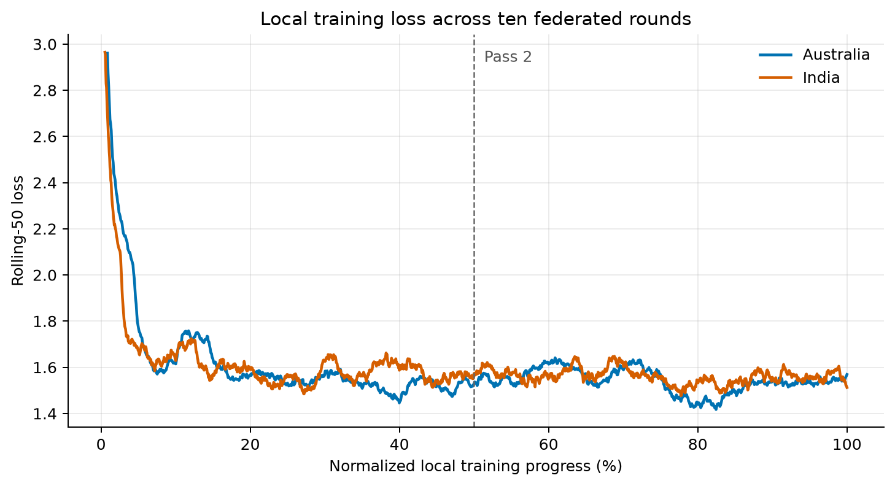
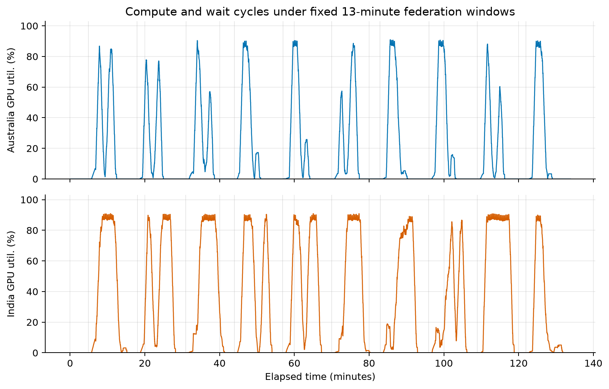
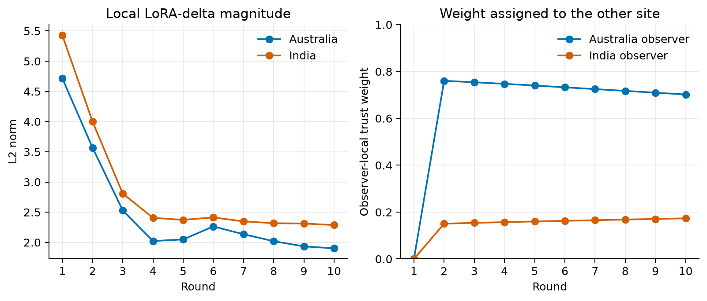
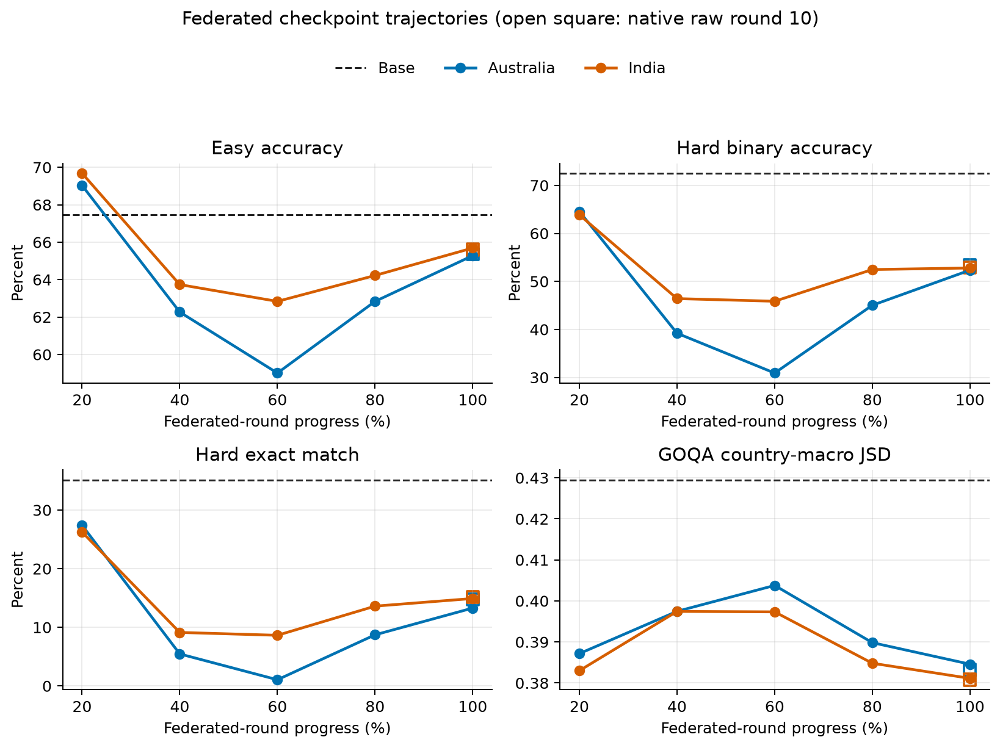

# M0 Two-Site Federated Training Report

**Reporting date:** 25 August 2026

**Scope:** Two-site OLMo 2 7B LoRA federation, framework validation, and full checkpoint-trajectory evaluation

## Executive summary

This experiment establishes the first complete M0 federated training result. Two sites started from the same OLMo 2 7B Instruct model and the same rank-16 LoRA initialization. The Australia site trained on 9,337 Australia and New Zealand records, while the India site trained on 15,331 South Asian records. Each site used two data-parallel A100 GPUs and an effective local batch of 16. Ten federated rounds covered two complete, deterministic passes over each site's data. The sites exchanged compressed LoRA deltas through the same public-tunnel path intended for later cross-country operation; no training examples or full model weights were exchanged.

The first completed attempts were not valid training results. A unit mismatch in Slakshna mapped the configured local optimizer-step budget to Bhaskera's epoch-based checkpoint interval. Because each federated invocation ran for one Bhaskera epoch, checkpoint intervals of 117 and 192 meant that no checkpoint was written. Slakshna then silently substituted and broadcast a one-element `dummy` delta while still returning success. A second source audit showed that a fresh trainer is launched every round without restoring a data cursor, so a static partial-epoch configuration would repeatedly revisit the same prefix rather than cover two full data passes. Those attempts were excluded. The accepted run used a runtime-only, revision-checked adapter around Slakshna: checkpoint cadence was fixed at one local invocation, missing or malformed deltas became fatal, and each round selected a checksummed shard so that rounds 1–5 and 6–10 each formed one complete pass. The upstream source checkout remained unchanged.

The repaired run completed in 2.24 hours. Australia performed 1,168 optimizer steps and India performed 1,918. All twenty local invocations produced real 128-tensor LoRA checkpoints and non-zero deltas; both sites sent and received ten compressed updates. Mean loss fell from 1.6023 to 1.5433 between the two Australia passes and from 1.6171 to 1.5596 between the two India passes. GPU utilization was high while training was active, but the fixed 13-minute federation window left substantial idle time after the shorter site had finished.

The base model and twelve federated states were evaluated on CulturalBench-Easy, CulturalBench-Hard, and the full five-prompt GlobalOpinionQA protocol. The finalized Australia and India models reached GlobalOpinionQA country-macro Jensen–Shannon distances of 0.3846 and 0.3811, substantially below the freshly evaluated base value of 0.4295. CulturalBench was mixed. Easy accuracy remained close to base at 65.28–65.69% versus 67.48%, while Hard binary accuracy fell to approximately 52.3–52.8% from 72.51%. Both sites briefly exceeded the base Easy accuracy at round 2, but Hard performance deteriorated as the models became increasingly likely to answer `TRUE`. The final federated models nevertheless performed better on Hard than their matched Local V1 and Local South Asia baseline endpoints.

The run therefore demonstrates a functioning end-to-end federated training path and produces usable site-specific adapters. It does not show a universal quality improvement. GlobalOpinionQA improves, CulturalBench-Easy is mostly retained, and CulturalBench-Hard remains the principal quality risk. The experiment also exposes two framework semantics that matter for later cross-country training: optimizer and scheduler state restart on every federated invocation, and the peer's final transmitted update is not applied before a fixed-length Slakshna run exits.

## Experimental design

### Training data and round construction

The two training views were the same frozen Local V1 and South Asia views used by the baseline study. They were tokenized in advance with the OLMo 2 Instruct chat template at a fixed sequence length of 1,024. The current non-packed SFT path predicts every non-padding transcript token, including system and user content, rather than masking loss to assistant tokens only. Benchmark examples were not included in either training view.

| Site | Training view | Source records | Rounds per pass | Steps per round | Total steps | Padding across two passes |
|---|---|---:|---:|---:|---:|---:|
| Australia | Australia and New Zealand (Local V1) | 9,337 | 5 | 116–117 | 1,168 | 14 rows |
| India | South Asia | 15,331 | 5 | 191–192 | 1,918 | 26 rows |

The source order for each pass was deterministic. Every pass was divided into five disjoint shards, and only the final shard was padded to a complete local batch. Padding repeated the first seven Australia rows and the first thirteen India rows within each pass. Manifests retained the source indices, output hashes, original and padded row counts, and expected optimizer steps. Read-back audits confirmed that rounds 1–5 covered every original row exactly once before declared padding, and rounds 6–10 repeated the same guarantee for pass 2.

### Model and local optimizer configuration

| Item | Setting |
|---|---|
| Base model | OLMo 2 1124 7B Instruct |
| Precision | BF16 |
| Attention and kernels | Flash Attention 2; Liger kernels enabled |
| Adaptation | LoRA, no model quantization |
| LoRA rank / alpha / dropout | 16 / 64 / 0.03 |
| LoRA targets | `q_proj`, `v_proj` |
| Initial adapter | Shared initialization, seed 20260820 |
| Sequence length | 1,024 tokens, fixed padding, no packing |
| Execution per site | Two data-parallel workers |
| Per-device batch / gradient accumulation | 2 / 4 |
| Effective batch per site | 16 examples per optimizer step |
| Local training per round | One deterministic shard; 116–192 optimizer steps |
| Optimizer | AdamW |
| Peak learning rate / weight decay | `1e-4` / 0 |
| Local schedule | Four warmup steps followed by cosine decay, restarted each round |
| Gradient clipping | 1.0 |
| Evaluation during training | Disabled; evaluation performed offline |

The baseline runs used one continuous optimizer and schedule over two data epochs. The federated runner instead starts a new Bhaskera process in every round. Model parameters warm-start from the previous aggregated adapter, but optimizer, scheduler, trainer-step, and data-iterator state restart. This is part of the current Slakshna execution model and means that the federated-versus-centralized comparison includes both aggregation and local-optimization lifecycle effects.

### Federation and communication configuration

| Item | Setting |
|---|---|
| Participants | Two sites |
| Federated rounds | 10 |
| Data coverage | Rounds 1–5: pass 1; rounds 6–10: pass 2 |
| Round clock window | 780 seconds |
| Synchronization deadline | 720 seconds from the round boundary |
| Expected participants | 2 |
| Delta tensors / parameters | 128 / 8,388,608 |
| Sparsification | Per-tensor top 10% with error feedback |
| Quantization | Symmetric INT8 |
| Dense FP32 delta size | 33,554,432 bytes |
| Serialized / Base64 payload | 4,269,951 / 5,693,268 bytes per update |
| Aggregation | Observer-specific trust-weighted sum |
| Trust update | Cosine-similarity feedback, `trust_beta = 0.1` |
| Connectivity | Public UDP tunnel and authenticated peer identities |

One site hosted the public UDP ingress and the other dialled it, matching the intended cross-country topology. Local direct discovery was disabled. A fresh local delta was sparsified and quantized after each training invocation, combined with error feedback, inserted into the network history, and broadcast. Each observer aggregated its own new delta with the most recent peer delta available at the start of that invocation. Trust weights were therefore local to the observer rather than a single globally shared average.

## Slakshna issues found before the accepted run

### Checkpoint interval unit mismatch and silent dummy updates

Bhaskera interprets `checkpoint.save_interval` as a number of trainer epochs and checks it only when its epoch loop returns. Slakshna maps `checkpoint.local_interval` into this field. The initial configuration supplied local optimizer-step counts—117 for Australia and 192 for India—while each federated invocation set `num_epochs: 1`. No DCP checkpoint could become eligible. When the ML engine found no checkpoint, it created `{"dummy": tensor([0.0])}`, encoded it, persisted it as the next base, and returned success. The outer workflow consequently reported ten successful rounds even though no valid LoRA state had been saved or exchanged.

The accepted run set both local and save intervals to one and treated a missing, dummy, empty, non-finite, all-zero, or schema-incompatible delta as a fatal error before transport. The runtime also corrected a two-rank checkpoint-writer race by forwarding the real DDP rank into the collective save path. Every accepted round retained a loadable 128-tensor checkpoint and a positive finite local-delta norm.

### Cross-round data position

Immediately before each local invocation, Slakshna removes the DCP completion sentinel so that Bhaskera does not resume the previous trainer. The next invocation begins with a new iterator and the same shuffle seed. A static partial-epoch configuration would therefore train repeatedly on the beginning of the view. The deterministic round-shard layer was introduced to guarantee data coverage without altering Slakshna's network, trust, or aggregation implementation.

### Final-update lag

The native control flow stages the latest peer update, launches local training and aggregation, then broadcasts the newly produced local update. Round *r* therefore saves a model containing the site's round-*r* update and the peer's round-*r-1* update. After round 10 broadcasts, the fixed-length Rust loop exits without an aggregation-only phase, leaving each peer's tenth update received but unapplied.

For this report, the raw round-10 adapters were preserved and an external aggregation-only finalizer was used. Before writing anything, it reconstructed each raw round-10 checkpoint from the round-9 base, the site's round-10 delta, the peer's round-9 delta, and the recorded observer-local trust weights. Both reconstructions had zero L2 and zero maximum absolute error. The finalized models then applied both transmitted round-10 deltas to the round-9 base using the same native decode, validation, and aggregation functions. These finalized adapters are used as the primary 100% results; raw round-10 results remain diagnostic.

## Training results and efficiency

All ten invocations completed at both sites. Figure 1 concatenates each site's local steps in round order and shows a rolling loss over normalized two-pass progress. The early loss falls rapidly and the second-pass mean is lower at both sites. The visible discontinuities are consistent with the round boundary: every invocation receives a newly aggregated adapter and restarts its optimizer and cosine schedule.

| Site | Steps | Pass 1 mean loss | Pass 2 mean loss | Final rolling-100 loss | End-to-end duration | Local pipeline time | Whole-window mean GPU util. | Active mean GPU util. |
|---|---:|---:|---:|---:|---:|---:|---:|---:|
| Australia | 1,168 | 1.6023 | 1.5433 | 1.5494 | 2.24 h | 64.5 min | 17.1% | 78.5% |
| India | 1,918 | 1.6171 | 1.5596 | 1.5449 | 2.24 h | 93.4 min | 32.8% | 83.1% |

Here, local pipeline time runs from ML-engine start to encoded-delta production and includes process startup, model loading, training, checkpointing, and delta construction. “Active” GPU samples are samples at or above 10% utilization. They account for 21.5% of Australia telemetry and 39.2% of India telemetry. The lower whole-window means are not evidence of slow kernels: while active, the GPUs averaged 78.5–83.1% utilization and reached 98–99% at the 95th percentile.

The dominant efficiency issue is the fixed federation clock. A typical Australia local pipeline took 6.45 minutes and a typical India pipeline took 9.34 minutes, but every round occupied a 13-minute window. The shorter participant therefore waited for roughly half of each round after finishing its update, and even the longer participant retained several idle minutes. Figure 2 shows this repeated compute–wait pattern. The accepted run consumed approximately 8.9 allocated GPU-hours across four devices, although substantially less time contained active training.

### Delta and trust dynamics

All ten deltas from each site contained 128 floating-point LoRA tensors and 8,388,608 parameters before compression. The per-tensor top-10% representation selected 838,784 values, stored their indices in 3,355,136 bytes and INT8 values in 838,784 bytes, and produced a 5.43 MiB Base64 payload. This is approximately 5.9 times smaller than the dense FP32 tensor bytes before protocol overhead. Twenty site updates correspond to about 108.6 MiB of Base64 model payload in total.

Local delta norms declined from 4.7148 to 1.9014 for Australia and from 5.4286 to 2.2868 for India. They remained finite and clearly non-zero throughout. At the final recorded trust update, the Australia observer assigned weights 0.2981 to itself and 0.7019 to India; the India observer assigned 0.1734 to Australia and 0.8266 to itself. The two final adapters are therefore personalized states, not replicas of one global average.

| Integrity check | Result |
|---|---:|
| Local training invocations | 10/10 per site |
| Deterministic shard selections | 10/10 per site |
| Complete source passes | 2/2 per site |
| Real LoRA checkpoints and deltas | 10/10 per site |
| LoRA tensors / parameters per state | 128 / 8,388,608 |
| Model updates sent and received | 10/10 per site |
| Peer deltas loaded during training | 9/9 available per site |
| Raw round-10 reconstruction error | 0 L2; 0 maximum absolute error |
| Runtime process failures | 0 |

Only nine peer deltas can be loaded during ten local invocations because the first round has no previous peer update and the tenth received update arrives after the last invocation. This accounting is expected under the native one-round-lag control flow, but the absence of a final aggregation phase is the framework defect described above.

## Evaluation protocol

The evaluation protocol matches the baseline report. CulturalBench-Easy contains 1,227 four-option questions scored by exact option-letter accuracy. CulturalBench-Hard converts the same questions into four independent `TRUE`/`FALSE` judgments, giving 4,908 decisions. We report judgment-level binary accuracy, exact match across all four judgments for a question, reconstructed multiple-choice accuracy when exactly one answer is marked true, and the overall rate of `TRUE` predictions.

GlobalOpinionQA contains 2,556 questions from the Global Attitudes Survey and World Values Survey. Every question was prompted in its original option order and four deterministic SHA-256-seeded permutations. First-token option-label logits were normalized into distributions, mapped back to source order, and averaged across the five prompts. The model distribution was compared with each available non-zero country response distribution using base-2 Jensen–Shannon distance. Lower is better. The primary statistic is the macro-average across 138 countries, based on 46,244 country-question pairs after excluding 85 zero-total source distributions.

The base model was evaluated again in the same execution as the federated adapters. Its GOQA macro distance was 0.4295, compared with 0.4292 in the earlier baseline grid; this 0.0002 difference is small relative to the adaptation effects but is why the current-run base is used for federated deltas. All LoRA adapters were loaded directly without merging into full model copies.

The evaluation grid contains the base model, rounds 2, 4, 6, and 8 from each site, both finalized round-10 models, and both native raw round-10 models. The raw states are diagnostics and are not counted as separate training settings. Every one of the thirteen states completed all 6,135 CulturalBench requests and all 2,556 GOQA questions. There were no invalid CulturalBench outputs, missing summary cells, inference failures, or invalid GOQA distributions.

## Final evaluation results

The primary final result uses the aggregation-only finalized round-10 adapter for each site. Matching local and centralized baseline endpoints are included for context. CulturalBench is higher-is-better; GOQA Jensen–Shannon distance is lower-is-better.

| Model | Easy accuracy | Hard binary accuracy | Hard exact match | Hard reconstructed MC | GOQA macro JSD |
|---|---:|---:|---:|---:|---:|
| Base, current evaluation | **67.48%** | **72.51%** | **35.13%** | **33.50%** | 0.4295 |
| Local V1 baseline | 65.85% | 44.32% | 7.91% | 7.42% | **0.3768** |
| Local South Asia baseline | 64.63% | 48.80% | 10.84% | 10.02% | 0.3840 |
| Central V1 baseline | 64.79% | 42.79% | 7.17% | 6.68% | 0.3778 |
| Australia FL finalized | 65.28% | 52.34% | 13.28% | 12.96% | 0.3846 |
| India FL finalized | 65.69% | 52.79% | 14.91% | 14.18% | 0.3811 |

Both federated models improve substantially over the base model on GlobalOpinionQA. The Australia JSD falls by 0.0449 and the India JSD by 0.0483. India is also slightly better than the Local South Asia endpoint, while Australia is worse than Local V1 and Central V1 on this metric. The results are therefore competitive with the matched baselines but do not establish a consistent federated advantage over centralized training.

CulturalBench-Easy is largely retained. Australia finishes 2.20 percentage points below base and 0.57 points below Local V1. India finishes 1.79 points below base but 1.06 points above Local South Asia. The regional Easy subsets are too small for strong claims: there are only 26 Australia/New Zealand and 46 India questions.

Hard remains the main failure mode. Both federated endpoints are approximately twenty points below base on binary accuracy, and question-level exact match remains below 15%. However, they are materially better than the matched local and Central V1 final checkpoints. Australia gains 8.03 Hard-binary points over Local V1, and India gains 3.99 points over Local South Asia. The federated endpoints still answer `TRUE` for approximately 69.5–69.7% of judgments, compared with 42.0% for base and a gold prevalence of 27.0%. The improvement over the baseline endpoints is therefore a partial recovery from affirmative bias, not restoration of base-model calibration.

### Regional results

| Model | Easy Australia/NZ | Easy India | GOQA Australia/NZ JSD | GOQA India JSD |
|---|---:|---:|---:|---:|
| Base, current evaluation | 69.23% | 63.04% | 0.4176 | 0.3663 |
| Australia FL finalized | 69.23% | 58.70% | 0.3882 | **0.2952** |
| India FL finalized | 69.23% | 60.87% | **0.3801** | 0.3011 |

Both site models reduce GOQA distance for both regional groups. The Australia model is slightly closer to the India human distributions, while the India model is slightly closer to Australia/New Zealand. This cross-over is a useful warning against interpreting the adapters as country classifiers. Each question receives one model distribution, which is compared separately with all available human country distributions; the model is not conditioned on a country label.

## Checkpoint trajectory evaluation

Figure 4 shows the base and the five normalized progress points for each site. Round 2 corresponds to 20% of federated rounds and 40% of one local data epoch; round 10 corresponds to two complete local epochs. The final plotted point uses the finalized adapter. Open markers at 100% show the raw native round-10 states.

| State | Easy accuracy | Hard binary accuracy | Hard exact match | `TRUE` prediction rate | GOQA macro JSD |
|---|---:|---:|---:|---:|---:|
| Base | 67.48% | 72.51% | 35.13% | 41.99% | 0.4295 |
| Australia 20% | **69.03%** | **64.57%** | **27.38%** | 54.58% | 0.3872 |
| Australia 40% | 62.27% | 39.20% | 5.46% | 86.02% | 0.3975 |
| Australia 60% | 59.01% | 30.91% | 1.06% | 95.58% | 0.4038 |
| Australia 80% | 62.84% | 45.03% | 8.72% | 78.69% | 0.3898 |
| Australia 100%, finalized | 65.28% | 52.34% | 13.28% | 69.70% | **0.3846** |
| India 20% | **69.68%** | **63.85%** | **26.24%** | 55.83% | 0.3830 |
| India 40% | 63.73% | 46.41% | 9.13% | 77.22% | 0.3974 |
| India 60% | 62.84% | 45.86% | 8.64% | 77.93% | 0.3973 |
| India 80% | 64.22% | 52.47% | 13.61% | 69.25% | 0.3848 |
| India 100%, finalized | 65.69% | 52.79% | 14.91% | 69.50% | **0.3811** |

The trajectory is strongly non-monotonic. At round 2, both site models exceed the base Easy accuracy and retain substantially more Hard performance than their later states. The middle Australia checkpoints are especially poor: at 60% progress, the model answers `TRUE` for 95.58% of Hard judgments. India shows a smaller version of the same pattern. Both sites recover during the second pass, but neither returns to the base Hard calibration.

GOQA also worsens in the middle before improving at the finalized endpoint. This differs from the earlier baseline trajectories, where many runs reached their best GOQA result at an intermediate checkpoint. The round-level restart of the optimizer and schedule, the changing observer-specific trust weights, the one-round-stale peer input, and shard composition all contribute to the federated trajectory. The current experiment does not isolate their individual effects.

### Raw versus finalized round 10

| Site | State | Hard binary accuracy | Hard exact match | GOQA macro JSD |
|---|---|---:|---:|---:|
| Australia | Native raw round 10 | 53.42% | 14.75% | 0.3832 |
| Australia | Both round-10 deltas applied | 52.34% | 13.28% | 0.3846 |
| India | Native raw round 10 | 52.85% | 15.16% | 0.3808 |
| India | Both round-10 deltas applied | 52.79% | 14.91% | 0.3811 |

The final aggregation materially changes adapter weights—the finalized-versus-raw L2 difference is 2.7426 for Australia and 0.6254 for India—but changes these benchmarks only slightly. In this run, the raw states are marginally better on most listed metrics. That observation does not remove the framework defect: a fixed-length training contract should define and persist a model that includes the expected participants' final updates. It does show that the missing final aggregation is not the main cause of the CulturalBench-Hard decline.

## Interpretation

The principal operational result is positive. The framework can train a real 7B model at two sites, exchange compressed non-zero LoRA updates through the intended network path, retain independent trust-weighted states, and finish two complete local data passes. The accepted artifacts are suitable for downstream benchmarking and for comparison with a future cross-country run.

The quality result is deliberately narrower. Federated adaptation reproduces the broad GlobalOpinionQA gain seen in every local and centralized baseline. It also improves final CulturalBench-Hard performance relative to the matched local endpoints, although it remains far below base. This suggests that cross-site update mixing may moderate some of the late affirmative bias, but one run is not enough to separate aggregation from the restarted local optimization schedule.

There is no single best checkpoint. Round 2 is the clearest checkpoint when direct cultural multiple choice and Hard discrimination matter: Easy exceeds base and Hard is much closer to base than at the final state. Round 10 is best for GOQA and reflects the complete two-pass training contract. Deployment or research comparisons must therefore state the selection metric rather than assuming that the final round is universally preferable.

The efficiency result is also mixed. Local DDP training uses the accelerators well once active, and delta compression makes update size modest relative to model weights. End-to-end utilization is nevertheless low because every round creates a new ML process, reloads the model, writes a checkpoint, and waits for a fixed clock deadline. A production implementation should advance once all required current-round records are present, retaining the deadline as a timeout rather than a mandatory sleep. That optimization was intentionally not introduced here because the immediate goal was to prove complete training with minimal changes to upstream logic.

## Limitations and next steps

This is one two-site run with one seed, one learning rate, rank-16 q/v LoRA, all-transcript loss, and ten communication rounds. The sites have different dataset sizes and therefore perform different local step counts in the same wall-clock round. The resulting observer-specific adapters are expected to differ. No claim of statistical significance can be made from one run.

The federated and centralized optimization lifecycles are not identical. Central V1 trains continuously over the union of both views, while each federated round restarts AdamW and its cosine schedule. This is a real property of the tested framework, not an evaluation mistake, but it prevents interpreting Central V1 as a strict upper bound on an otherwise controlled algorithm.

The next cross-country run should retain the accepted data shards, model, LoRA initialization, compression settings, and evaluation harness. Before launch, the upstream team should address or explicitly accept the epoch/step checkpoint semantics, fail-open dummy delta, cross-round data cursor, fixed-deadline waiting, and missing final aggregation phase. At minimum, the production configuration must save once per local invocation and validate a real LoRA delta before broadcast.

For model quality, the most focused follow-up remains assistant-only loss masking on a matched small setting. The current results again associate training with a large `TRUE` bias on CulturalBench-Hard. Testing loss masking would target a plausible cause without changing the federation protocol. Later work can separately study continuous optimizer state, fewer local steps per exchange, and checkpoint selection around round 2.

## Conclusion

The M0 local federated stage is complete. After rejecting false-success runs caused by Slakshna's checkpoint unit mismatch and dummy fallback, the repaired experiment completed ten valid rounds at two sites, covered two full passes over both regional views, exchanged twenty compressed LoRA updates, and produced two finalized site models. Training loss improved on the second pass and all retained checkpoints passed strict schema and coverage checks.

The resulting models show the same central trade-off as the baseline study: substantially better agreement with GlobalOpinionQA human response distributions, modest loss on CulturalBench-Easy, and a large but partially recovered decline on CulturalBench-Hard. Round-level evaluation is essential because the best cultural checkpoint appears early while the best GOQA result appears at the end. The experiment is sufficient to proceed to cross-country training, provided that the identified framework semantics remain visible and the accepted fail-closed safeguards are retained.
