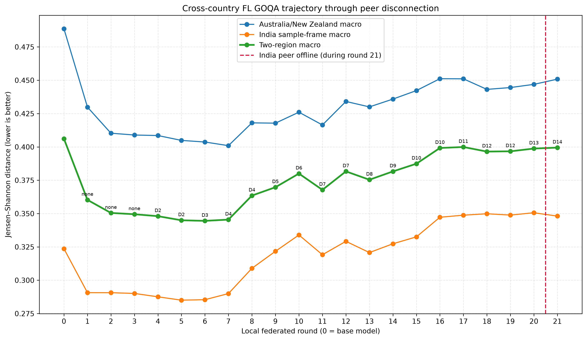

# M0 First Cross-Country Federated Training Report

**Reporting date:** 27 August 2026

**Scope:** First M0 Australia–India OLMo 2 7B training trajectory, cross-country federation behaviour, and GlobalOpinionQA evaluation

## Executive summary

This run is the first M0 cross-country exercise to produce a long sequence of loadable, measurably different model adapters. Two independently operated Slakshna sites established an authenticated peer-to-peer federation over a public UDP tunnel, launched real OLMo 2 7B LoRA training, and exchanged compressed parameter deltas for more than ten hours. The Australian site retained 21 adapters up to the point at which the Indian peer went offline. The first three Australian rounds contained only local training; Round 4 was the first retained model to incorporate a tracked Indian update. By Round 21, the Australian trajectory had incorporated 13 distinct tracked Indian deltas, although several deltas were reused because the two sites did not finish local work at the same rate.

The model trajectory is valid and useful, but the run must not be described as a completed full-data training job. The native Slakshna control flow starts a fresh Bhaskera trainer in every federated round and deliberately disables restoration of the previous distributed checkpoint. In the agreed configuration, each invocation stops after 50 optimizer steps, well before the Australian site's 9,337-example view can complete one data epoch. The iterator and optimizer then restart with the same seed in the next round. As a result, adding rounds does not reliably advance through the remaining training records; it repeatedly trains a deterministic early portion of the view. This is a severe framework limitation for full training and prevents assigning a defensible number of completed data epochs to this run.

All retained Australian adapters were evaluated with the shared Australia/New Zealand/India GlobalOpinionQA package. The evaluation covered 1,106 questions and 1,831 valid human-distribution targets under five deterministic prompt permutations. The best checkpoint was Round 6, after Indian delta D3 had been incorporated. Its two-region macro Jensen–Shannon distance was 0.344542, compared with 0.406107 for the unchanged base model, a 15.2% relative reduction. Performance then deteriorated. Round 21 reached 0.399472, only 1.6% below base and materially worse than Round 6. The decline began around Round 8, many hours before the Indian peer disconnected, so the disconnection did not cause the principal quality regression.

The operational conclusion is therefore positive but qualified. The framework performed real cross-country training, transport, delta decoding, aggregation, and checkpoint retention, and the early adapters show a substantial improvement on the selected M0 benchmark. At the same time, the current full-train semantics do not guarantee dataset coverage, site progress is not synchronized, stale peer deltas can be reused, and a disconnected peer does not stop local rounds. These issues must be resolved or explicitly controlled before the final M0 run can be treated as complete training over the agreed regional datasets.

## Experimental setting

### Training data and model

The Australian site used the agreed Australia/New Zealand V1 training view. It contained 9,337 tokenized examples prepared with the OLMo 2 Instruct chat template, a maximum sequence length of 2,048, no sequence packing, and assistant-only labels (`train_on_inputs: false`). The Indian site was expected to use the agreed South Asia view. The present report is based on Australian checkpoints and local transport logs; the Indian dataset artifact, trainer log, and adapter sequence were not copied into the local evidence package, so Indian record coverage and optimizer-step counts are not independently audited here.

The training model was the base-weight `allenai/OLMo-2-1124-7B`, not the separately instruction-tuned checkpoint. Tokenization used the compatible `allenai/OLMo-2-1124-7B-Instruct` tokenizer and chat template. Evaluation deliberately used the same base weights and tokenizer combination, so Round 0 and the trained adapters are directly comparable.

| Item | Australian-site setting |
|---|---|
| Base weights | `allenai/OLMo-2-1124-7B` |
| Tokenizer / chat template | `allenai/OLMo-2-1124-7B-Instruct` |
| Precision | BF16 |
| Distributed strategy | FSDP, two workers |
| Adaptation | LoRA on `q_proj` and `v_proj` |
| LoRA rank / alpha / dropout | 16 / 64 / 0.03 |
| Sequence length | 2,048 |
| Training examples | 9,337 Australia/New Zealand records |
| Per-worker batch / gradient accumulation | 4 / 8 |
| Configured local work | 50 optimizer steps per Slakshna invocation |
| Optimizer | 8-bit Muon plugin |
| Learning rate / warmup | `3e-4` / 5 steps |
| Loss masking | Assistant tokens only |

### Federation and delta exchange

The sites used authenticated Iroh identities and a public UDP tunnel. Only model updates and protocol metadata crossed the link; training examples and full model weights were not transmitted. Each local LoRA delta was sparsified to the configured top 10% of values per tensor, quantized with symmetric INT8, encoded, and gossiped to the peer. The Australian runtime observed a normal model-update payload of approximately 5.43 MiB. At aggregation time, Slakshna combined the new local delta with the most recent peer delta available to that observer, using locally maintained trust weights.

| Federation item | Setting or observation |
|---|---|
| Sites | Australia and India |
| Expected participants | 2 |
| Federation clock / sync deadline | 600 s / 600 s |
| Compression | Top-10% sparsity with symmetric INT8 |
| Typical encoded model update | Approximately 5.43 MiB |
| Aggregation | Observer-local trust-weighted delta sum |
| Australian adapters retained for evaluation | Base plus Rounds 1–21 |
| First tracked Indian delta used | D2 in Round 4 |
| Last tracked Indian delta used | D14 in Round 21 |
| Indian peer disconnection | During Australian Round 21 |

Although both clock settings were ten minutes, the effective Australian round cadence was approximately 30 minutes. Local FSDP training and checkpoint extraction generally occupied a little over twenty minutes, after which the process waited for the next clock boundary. Site speed was not synchronized. The same Indian delta was therefore used by two consecutive Australian rounds in several places: D2 in Rounds 4–5, D4 in Rounds 7–8, D7 in Rounds 11–12, D10 in Rounds 15–16, and D12 in Rounds 18–19. This is valid under the current “latest available update” implementation, but it is not synchronous FedAvg and should not be interpreted as one fresh update from every participant per numbered local round.

The Indian peer left the gossip mesh during Australian Round 21. Round 20 is the last checkpoint saved before disconnection. Round 21 was saved afterward and contains D14, the final peer delta received shortly before the disconnect. The Australian process continued to train additional local rounds after the peer disappeared and continued to find the cached D14 delta. Those later states were intentionally excluded from this evaluation because they no longer represented active two-site federation.

## What the current Slakshna execution actually trains

The term “federated round” in this run means one launch of `ml_engine.py` and one fresh Bhaskera training process. Bhaskera receives the aggregated LoRA weights from the previous round, but Slakshna removes the distributed-checkpoint completion sentinel before every launch. The next process therefore does not restore the previous optimizer, scheduler, trainer step, or dataset cursor. Its `max_steps` counter starts at zero, its single trainer epoch starts at the beginning of the iterator, and the configured random seed returns to the same value.

For the Australian view, two FSDP workers with batch 4 and gradient accumulation 8 give a nominal site-effective batch of 64 examples per optimizer step. A complete pass over 9,337 records consequently requires about 146 optimizer steps. The native configuration stops at 50 steps, or approximately 3,200 site-level example presentations, before the epoch can finish. The checkpoint metadata records 1,600 samples consumed per worker at Step 50, consistent with this calculation. Because the next Slakshna invocation restarts rather than continues from that cursor, 21 rounds cannot be converted into `21 × 50 / 146` completed epochs. They are repeated partial invocations, and reliable unique-record coverage is substantially less than that arithmetic would imply.

This limitation is more serious than ordinary epoch-label ambiguity. A full M0 run is supposed to expose each site model to the complete agreed dataset for a specified number of passes. The current native mechanism cannot simultaneously stop at multiple communication boundaries inside an epoch and guarantee that the next invocation resumes from the correct record. Setting `max_steps` to a full epoch would obtain coverage but permit only one exchange per epoch. Setting it to a smaller value gives more exchanges but revisits the same deterministic prefix. Configuration alone cannot satisfy both requirements under the present control flow.

The earlier accepted local-FL experiment avoided this failure by presenting a different checksummed shard to every round, with five shards forming one complete pass. That protection was intentionally absent here because the cross-country exercise followed the upstream native configuration. The next formal training run therefore needs either a persistent cross-round data cursor, deterministic disjoint round shards, or a single long-lived trainer that exposes step-based exchange hooks. Without one of these mechanisms, a claim of completed full-data training would be unsupported.

## Evaluation protocol

The evaluation used the self-contained M0 GlobalOpinionQA Australia/New Zealand and India subset. It retains only questions with at least one valid human response distribution for the target regions and does not impute missing country distributions. The same model distribution is compared separately with every available human target; the prompt does not tell the model which country is being scored.

Each question was presented in the source option order and four deterministic SHA-256-seeded option permutations. One-token option log probabilities were normalized, mapped back to source order, and averaged across the five prompts. The averaged prediction was compared with each available human distribution using base-2 Jensen–Shannon distance. The metric lies between zero and one, and lower is better.

| Evaluation coverage | Count |
|---|---:|
| Unique questions | 1,106 |
| Total valid human target pairs | 1,831 |
| Australia pairs | 626 |
| New Zealand pairs | 273 |
| India current-national pairs | 470 |
| India non-national pairs | 340 |
| India old-national pairs | 122 |
| Prompt variants per question | 5 |
| Model states evaluated | 22 |

The Australia/New Zealand metric is an equal macro average of the Australia and New Zealand question means. The India metric is an equal macro average of the current-national, non-national, and old-national sample-frame means. The primary two-region result gives equal weight to these two regional metrics. Every state produced exactly 1,106 predictions, and all dataset hashes, target counts, adapter schemas, and result manifests passed validation.

## Evaluation results

Figure 1 shows the complete Australian trajectory through the peer disconnection. Round 0 is the unchanged training base model. Labels D2–D14 identify the Indian peer delta present in the saved Australian adapter. A repeated label means that no newer peer delta was available when the next Australian local invocation began.

The strongest gain appeared early. Round 1 reduced the two-region distance from 0.406107 to 0.360272 before a tracked peer delta was incorporated, showing that local Australian adaptation alone produced a large initial movement. Rounds 4–7, after peer updates began to enter the model, formed the best region of the trajectory. Round 6 was the overall optimum at 0.344542. Relative to base, it reduced Australia/New Zealand distance by 17.4%, India distance by 11.8%, and the equal two-region metric by 15.2%.

| Selected state | Peer delta used | Australia/NZ JSD | India JSD | Two-region JSD | Interpretation |
|---|---|---:|---:|---:|---|
| Base | None | 0.488578 | 0.323637 | 0.406107 | Unchanged training base |
| Round 1 | None | 0.429841 | 0.290703 | 0.360272 | Large local-only early gain |
| Round 4 | D2 | 0.408530 | 0.287577 | 0.348054 | First retained state with tracked peer delta |
| **Round 6** | **D3** | **0.403670** | **0.285415** | **0.344542** | **Best overall checkpoint** |
| Round 7 | D4 | 0.400937 | 0.289990 | 0.345464 | Best Australia/NZ checkpoint |
| Round 8 | D4 reused | 0.418040 | 0.308940 | 0.363490 | First large regression |
| Round 15 | D10 | 0.442253 | 0.332530 | 0.387392 | Late trajectory near base |
| Round 20 | D13 | 0.446914 | 0.350624 | 0.398769 | Last checkpoint before disconnect |
| Round 21 | D14 | 0.450824 | 0.348119 | 0.399472 | First checkpoint saved after disconnect |

After Round 7, benchmark agreement weakened rather than improving monotonically. The largest clear transition was Round 7 to Round 8: the same D4 peer delta was reused, while the two-region distance rose by 0.018026. Subsequent states fluctuated, with a temporary recovery at Round 11, but the broad direction remained worse. By Round 21, the two-region result retained only a 0.006636 absolute advantage over base. Continued local loss reduction therefore did not translate into continued GOQA improvement.

The evidence does not isolate one cause for the regression. Plausible contributors include repeatedly optimizing the same data prefix, restarting Muon and its warmup schedule every round, applying peer deltas at unequal site progress, and reusing stale deltas. These mechanisms act together in the current run, so none should be presented as a proven individual cause. The timing does establish one useful negative conclusion: the main decline started around Round 8, whereas the peer remained connected until Round 21. Peer disconnection is therefore not a credible explanation for the earlier quality loss.

### Complete checkpoint table

| Model | Peer delta | Australia/NZ macro | India macro | Two-region macro |
|---|---|---:|---:|---:|
| Base | None | 0.488578 | 0.323637 | 0.406107 |
| Round 1 | None | 0.429841 | 0.290703 | 0.360272 |
| Round 2 | None | 0.410276 | 0.290671 | 0.350473 |
| Round 3 | None | 0.408915 | 0.290106 | 0.349510 |
| Round 4 | D2 | 0.408530 | 0.287577 | 0.348054 |
| Round 5 | D2 | 0.404876 | 0.285059 | 0.344967 |
| Round 6 | D3 | 0.403670 | 0.285415 | 0.344542 |
| Round 7 | D4 | 0.400937 | 0.289990 | 0.345464 |
| Round 8 | D4 | 0.418040 | 0.308940 | 0.363490 |
| Round 9 | D5 | 0.417811 | 0.321710 | 0.369761 |
| Round 10 | D6 | 0.426043 | 0.333951 | 0.379997 |
| Round 11 | D7 | 0.416443 | 0.319131 | 0.367787 |
| Round 12 | D7 | 0.434095 | 0.329196 | 0.381645 |
| Round 13 | D8 | 0.430000 | 0.320757 | 0.375379 |
| Round 14 | D9 | 0.435863 | 0.327354 | 0.381609 |
| Round 15 | D10 | 0.442253 | 0.332530 | 0.387392 |
| Round 16 | D10 | 0.451151 | 0.347246 | 0.399198 |
| Round 17 | D11 | 0.451068 | 0.348790 | 0.399929 |
| Round 18 | D12 | 0.443139 | 0.349878 | 0.396508 |
| Round 19 | D12 | 0.444519 | 0.348868 | 0.396694 |
| Round 20 | D13 | 0.446914 | 0.350624 | 0.398769 |
| Round 21 | D14 | 0.450824 | 0.348119 | 0.399472 |

## Current problems and risks

### Full-data training does not complete a reliable data epoch

This is the blocking correctness issue. Fixed short `max_steps` values create communication opportunities, but every round restarts the trainer and data iterator, so later rounds do not continue from the previous stopping point. The resulting model can converge on the repeatedly visited subset while never seeing much of the dataset. A falling training loss and a large number of local rounds are therefore insufficient evidence that full training occurred. The final M0 configuration must fail validation unless it can demonstrate exact source-record coverage for the requested number of epochs.

### Local round numbers do not represent synchronized global progress

Australia and India trained at different speeds. Slakshna aggregates the newest peer delta available locally rather than waiting for a uniquely matched update from the same global round. A peer update can be reused, and local round counters can diverge. Reports and plots must therefore identify the actual peer delta incorporated into each checkpoint, as done here, rather than assuming that Australian Round 8 contains Indian Round 8.

### Optimizer and scheduler state restart every round

Only adapter weights carry forward. Muon state, warmup position, scheduler state, trainer step, and iterator state are rebuilt for every local invocation. This changes the optimization algorithm relative to continuous centralized training and repeatedly applies the high-learning-rate early schedule. It may also contribute to the strong early gain followed by degradation.

### Peer loss does not terminate or freeze the federation

After the Indian endpoint left the gossip mesh, the Australian process continued to schedule local rounds and retained the last extracted D14 payload. `expected_peers = 2` did not act as a fail-closed liveness requirement. This behaviour risks silently converting a two-site job into local training with indefinitely reused peer state. The production run needs an explicit policy for missed rounds, stale-update age, reconnection, and termination.

### The final received update can be one invocation late

The local model used for an invocation is assembled from the peer update available at its start. A peer update arriving during local training is staged for a later invocation. If a job stops immediately after transmission or disconnection, the most recently received update may never be incorporated into a jointly active next round. A final aggregation barrier or an explicit finalized checkpoint is needed for an unambiguous endpoint.

### Evaluation is presently benchmark- and observer-specific

The completed evaluation covers GOQA only and evaluates the Australian observer's personalized adapters. It does not include CulturalBench, task-performance benchmarks, the Indian observer's adapters, or multiple random seeds. The early GOQA gain is real under the audited protocol, but it is not evidence of universal model-quality improvement. Prior M0 baselines also showed that GOQA can improve while CulturalBench-Hard deteriorates, so the eventual formal run must retain broader evaluation.

## Recommendations for the next formal run

The immediate priority is to make dataset coverage explicit. The least invasive proven option is deterministic round sharding: divide each site's tokenized view into disjoint, checksummed pieces, use one piece per communication round, and require that a declared group of rounds reconstruct exactly one full data pass. A native alternative is to preserve and restore the Bhaskera data cursor and optimizer state across Slakshna invocations. A longer-term design could keep one trainer alive and expose aggregation hooks at optimizer-step boundaries. Whichever implementation is chosen, the run manifest should record source indices, examples consumed, optimizer steps, checkpoint hashes, and the peer delta used for every round.

The exchange policy also needs a precise contract. A checkpoint should distinguish a newly received delta from a reused stale delta, include the source peer's own update sequence number, and enforce a maximum staleness. The job should pause or fail when the required peer disappears for longer than the agreed tolerance. At planned completion, both sites should enter a final aggregation phase so that the last successfully transmitted updates are either applied at both observers or explicitly reported as unapplied.

For model selection, Round 6 should be retained as the current M0 candidate because it is the strongest audited GOQA checkpoint. Round 7 and Round 8 should also be preserved around the observed turning point. The next evaluation should add the same CulturalBench-Easy and CulturalBench-Hard protocols used for the baseline study and should obtain the Indian observer's checkpoint sequence. A shorter formal schedule or benchmark-based early stopping may be appropriate, but only after the data-coverage defect is fixed; stopping early on a repeatedly sampled prefix would not solve the underlying training problem.

## Conclusion

The first M0 cross-country run moved beyond connectivity testing. It trained a real OLMo 2 7B LoRA model at both sites, exchanged compact non-zero updates over the intended international network path, retained an auditable Australian checkpoint trajectory, and produced a substantial early improvement on the agreed regional GOQA metric. Round 6 reduced the two-region Jensen–Shannon distance by 15.2% relative to the exact training base model.

The same run also demonstrates why it cannot yet be called successful full-data training. Native Slakshna restarts the training and data lifecycle at every short federated invocation, so the model does not reliably traverse a complete data epoch. Quality peaks early and then regresses, site progress and delta application are asynchronous, and training continues after peer loss. The result is an important M0 milestone and a useful checkpoint-selection study, but the final cross-country run must add verifiable data coverage and explicit synchronization/liveness semantics before its endpoint can support a complete-training claim.
