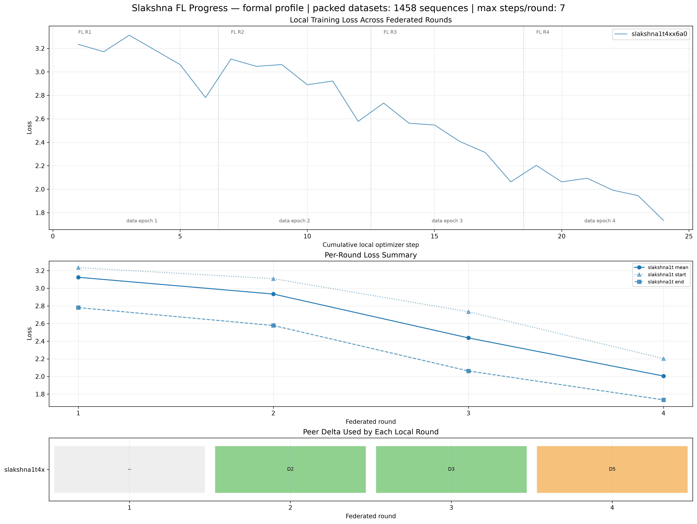
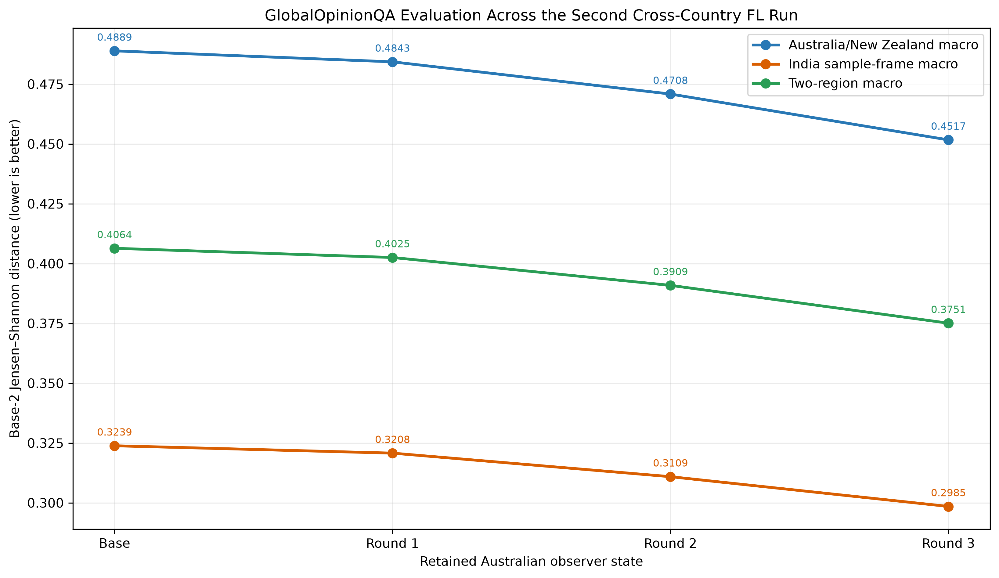

# M0 Second Cross-Country Federated Training Report

**Reporting date:** 30 August 2026

**Scope:** Second Australia–India M0 joint run using OLMo 2 7B, with federated training behaviour, retained Australian observer adapters, and GlobalOpinionQA evaluation

## Executive summary

The second M0 cross-country session established a live two-participant Slakshna federation, trained the Australian OLMo 2 7B LoRA model for four local invocations, received compressed updates from the Indian peer, and retained three complete Australian observer adapters. Round 1 was local-only because no peer update was available at its start. Rounds 2 and 3 each loaded and merged an Indian update before saving `sync_round_2` and `sync_round_3`. The Indian endpoint left the gossip mesh during Round 4. Although the Australian local trainer completed its six optimizer updates for that invocation, the process was stopped before a fourth synchronized adapter was written. The defensible output of the run is therefore three complete adapters with two confirmed peer merges, not four completed federated checkpoints.

The training loss moved in the expected direction. Mean local loss fell from 3.1250 in Round 1 to 2.4375 in the last retained federated state, while the Round 3 end loss reached 2.0625. Round 4 continued to a mean loss of 2.0052 and an end loss of 1.7344, but that state was not finalized and was excluded from model evaluation.

GlobalOpinionQA results improved monotonically across every retained adapter. The primary equal two-region Jensen–Shannon distance fell from 0.406373 for the unchanged base model to 0.375086 at Round 3, a 0.031287 absolute and 7.70% relative reduction. Australia/New Zealand and all three Indian survey sample frames improved together. This is a stronger result than a connectivity-only test: the run produced loadable, distinct adapters, performed two real cross-country merges, and moved the selected benchmark consistently in the favourable direction.

The result remains a short validation run rather than completed M0 training. Only the Australian observer's artifacts were audited locally, only one benchmark was run, and each local invocation consumed 1,344 of the 1,458 packed sequences. The incomplete tail was dropped because it could not form another full distributed gradient-accumulation update. In addition, each federated round starts a new trainer. The run should therefore not be described as four exact full-data epochs, and the next session should retain a final synchronization barrier before either participant stops.

## Experimental setting

### Software and execution path

The run used Slakshna revision `a73287fd56b1d1e935482c2f76771a33d2f05b0c`. Bhaskera was explicitly switched to its upstream `Slakshna` branch at revision `75a2698b60313aa6b26124312c3329cb72083b9b`, as requested by the collaborating team immediately before launch. Slakshna started a fresh two-rank Bhaskera FSDP trainer in each federation window and retained the Australian observer's synchronized LoRA state after aggregation.

The training process used PyTorch 2.9.0 with CUDA 12.8. Evaluation used vLLM 0.13.0 and Transformers 4.57.6. The evaluator loaded the unchanged OLMo base weights and each LoRA adapter directly; no adapter was merged into a full model copy.

### Model, data, and optimization

The Australian site used the Australia/New Zealand M0 training view. Its 9,337 source conversations were tokenized with the OLMo 2 Instruct tokenizer and chat template, packed to length 2,048, and trained with assistant-only labels. The resulting cache contains 1,458 packed sequences. It has a fixed capacity of 2,985,984 token positions, 2,556,907 non-padding input tokens, and 153,451 tokens with supervised assistant labels. Packing utilization is 85.63%.

The model weights were the base `allenai/OLMo-2-1124-7B` checkpoint. The compatible `allenai/OLMo-2-1124-7B-Instruct` tokenizer and chat template were used for both data preparation and evaluation prompting. The Indian site was operated independently. Its source data, local trainer log, and adapter sequence were not transferred into the Australian evidence package, so this report does not claim to audit the Indian site's record coverage.

| Item | Actual Australian-site setting |
|---|---|
| Base model | `allenai/OLMo-2-1124-7B` |
| Tokenizer / chat template | `allenai/OLMo-2-1124-7B-Instruct` |
| Precision | BF16 |
| Distributed strategy | FSDP, two workers |
| Adaptation | LoRA on `q_proj` and `v_proj` |
| LoRA rank / alpha / dropout | 16 / 64 / 0.03 |
| Trainable LoRA tensors / parameters | 128 / 8,388,608 |
| Optimizer | 8-bit Muon |
| Learning rate / warmup | `4.5e-4` / 0 steps |
| Per-worker batch size | 14 packed sequences |
| Gradient accumulation | 8 |
| Nominal site-effective batch | 224 packed sequences per optimizer update |
| Configured maximum local steps | 7 |
| Observed completed optimizer updates | 6 per invocation |
| Sequence length / packing | 2,048 / enabled |
| Source conversations | 9,337 |
| Packed training sequences | 1,458 |
| Non-padding / supervised tokens | 2,556,907 / 153,451 |
| Loss masking | Assistant responses only |
| Local interval / sync interval / configured retention | 1 / 1 / 1 |

The dataset was split across the two FSDP workers. Each worker recorded 112 packed sequences per optimizer update and 672 after six completed updates. At site level, an invocation therefore consumed 1,344 packed sequences, or 92.18% of the 1,458-row cache. The remaining 114 sequences could not form another complete two-rank, eight-microbatch accumulated update and did not contribute to an optimizer step. The configured seventh step was consequently never reached.

### Federation and communication

The two authenticated Slakshna endpoints communicated across the real public-network path. Training data and full model weights remained local. A transmitted update contained the LoRA delta plus protocol metadata. Slakshna selected the configured top 10% of delta values, encoded their indices, quantized the retained values with symmetric INT8, and transported a Base64 payload of approximately 5.43 MiB.

| Federation item | Setting or observation |
|---|---|
| Federation ID | `slakshna-M0` |
| Expected participants | 2 |
| Federation clock | 300 seconds |
| Synchronization deadline | 300 seconds |
| Compression | Per-tensor top-10% sparsity, symmetric INT8 |
| Typical encoded model update | Approximately 5.43 MiB |
| Discovery | Explicit peer plus DHT/DNS discovery |
| Local accelerators | Two A100 GPUs |
| First Australian federation boundary | 18:15 local time |
| Indian peer departure | 19:10:14 local time, during Australian Round 4 |
| Complete synchronized Australian adapters | Rounds 1–3 |
| Confirmed peer merges | Rounds 2 and 3 |

Trust weights were observer-local rather than a single global scalar. At the last recorded Australian trust update, the normalized weights were approximately 0.617 for the Australian contribution and 0.383 for the Indian contribution. The saved Australian adapters are therefore personalized observer states, not replicas of a symmetric global average.

## Training trajectory and merge history

Figure 1 was generated directly with the external Slakshna progress tool. It concatenates positive-sample optimizer updates, summarizes each local invocation, and associates extracted peer updates with confirmed synchronized checkpoints. The `D` labels identify large remote update arrivals as observed locally. They are not guaranteed to equal the Indian site's own round number because repeated gossip delivery does not carry an authoritative global round label.

| Australian round | Start loss | Mean loss | End loss | Updates | Sequences per rank | Step-to-step duration | Peer update at start | Durable result |
|---:|---:|---:|---:|---:|---:|---:|---|---|
| 1 | 3.2344 | 3.1250 | 2.7812 | 6 | 672 | 370 s | None | `sync_round_1`, local-only |
| 2 | 3.1094 | 2.9349 | 2.5781 | 6 | 672 | 368 s | D2 | `sync_round_2`, merge confirmed |
| 3 | 2.7344 | 2.4375 | 2.0625 | 6 | 672 | 371 s | D3 | `sync_round_3`, merge confirmed |
| 4 | 2.2031 | 2.0052 | 1.7344 | 6 | 672 | 368 s | D5 extracted | Local work completed; no synchronized adapter |

The recorded loss decreases both within rounds and across successive invocations. Round boundaries introduce small upward resets because a new Bhaskera process, optimizer state, and data iterator are created. Nevertheless, the Round 2 start loss is below the Round 1 start loss, and the same pattern continues into Rounds 3 and 4. Across the four local invocations, mean loss decreases by 35.8% and end loss decreases by 37.6%.

The operational cadence was approximately fifteen minutes per Australian invocation, despite a five-minute federation clock. Model loading, FSDP initialization, six optimizer updates, DCP writing, delta construction, and aggregation together took longer than one clock window, so the next usable boundary was generally the third five-minute boundary. The six logged updates themselves occupied about 6.1–6.2 minutes; the remaining time was process startup, data setup, checkpointing, communication, and boundary waiting.

Round 4 illustrates an endpoint issue that should be handled explicitly in the next session. The Australian node extracted the latest Indian update at the round boundary, then the Indian endpoint disconnected while Australian local training was still active. The local trainer completed, but the session was stopped before `sync_round_4.pth` appeared. That local state is informative for the loss curve but is not a complete federated checkpoint and was not converted into an evaluation adapter.

## GlobalOpinionQA evaluation

### Protocol and coverage

Evaluation used the standalone `shared_evaluation/GOQA` package supplied for the M0 collaboration. The package is independent of Slakshna and Bhaskera. It retains questions with at least one valid Australia, New Zealand, or Indian human response distribution and does not impute missing groups.

Each question was presented under five deterministic option orders: the source order and four SHA-256-seeded permutations. Valid one-token option-label probabilities were normalized, mapped back to the source option order, and averaged. The resulting model distribution was compared independently with each available human distribution using base-2 Jensen–Shannon distance. Lower distance is better.

| Evaluation coverage | Count |
|---|---:|
| Unique questions | 1,106 |
| Prompt variants per model | 5,530 |
| Valid human target pairs | 1,831 |
| Australia pairs | 626 |
| New Zealand pairs | 273 |
| India current-national pairs | 470 |
| India non-national pairs | 340 |
| India old-national pairs | 122 |
| Evaluated states | Base plus Rounds 1–3 |

The Australia/New Zealand primary metric is an equal macro average of the Australia and New Zealand question means. The India metric is an equal macro average of the current-national, non-national, and old-national sample-frame means. The two-region metric gives equal weight to these two regional values. All four states produced exactly 1,106 predictions, and the shared package validated the dataset hash, prediction coverage, model distributions, and target counts before scoring.

### Results

Figure 2 shows a monotonic reduction in all three primary distances. Round 1 is the local-only Australian state. Rounds 2 and 3 are the first and second retained states with confirmed Indian update merges.

| Model state | Peer merge in this state | Australia/NZ macro JSD | India macro JSD | Two-region macro JSD | Relative two-region change vs base |
|---|---|---:|---:|---:|---:|
| Base | None | 0.488890 | 0.323855 | 0.406373 | — |
| Round 1 | None; local-only | 0.484298 | 0.320769 | 0.402534 | −0.94% |
| Round 2 | D2, confirmed | 0.470840 | 0.310927 | 0.390884 | −3.81% |
| **Round 3** | **D3, confirmed** | **0.451677** | **0.298494** | **0.375086** | **−7.70%** |

Round 3 improves the Australia/New Zealand macro by 0.037213, or 7.61%, relative to base. It improves the India sample-frame macro by 0.025361, or 7.83%. The similar relative change on both sides is notable because the evaluated model is the Australian observer state and the prompt contains no country identity.

| Target group | Base JSD | Round 1 | Round 2 | Round 3 | Round 3 change vs base |
|---|---:|---:|---:|---:|---:|
| Australia | 0.448941 | 0.444684 | 0.431331 | 0.412869 | −0.036072 |
| New Zealand | 0.528839 | 0.523913 | 0.510349 | 0.490485 | −0.038354 |
| India — current national | 0.332037 | 0.328710 | 0.320112 | 0.311860 | −0.020177 |
| India — non-national | 0.312884 | 0.309652 | 0.299954 | 0.287418 | −0.025467 |
| India — old national | 0.326644 | 0.323945 | 0.312715 | 0.296204 | −0.030440 |

All five disaggregated groups improve monotonically through Round 3. The largest absolute changes occur for New Zealand and Australia, while the largest relative change is observed for the smaller India old-national sample frame. No individual group moves against the aggregate trend.

The results do not by themselves separate local optimization from cross-site aggregation. Round 1 already improves on base before an Indian update is incorporated, demonstrating that Australian local adaptation contributes to the gain. The larger improvements after Rounds 2 and 3 are consistent with continued local training plus peer merging, but this single trajectory has no matched local-only control with the same restart schedule. It would therefore be premature to attribute the incremental gain solely to Indian updates.

## Operational findings

The second session validates the core path needed for a longer M0 run. A real remote endpoint joined the federation, multi-GPU local training completed repeatedly, non-zero LoRA deltas were compressed to modest network payloads, remote updates were extracted and loaded, and synchronized PEFT-compatible states were saved. The three retained checkpoint files each contain 128 finite LoRA tensors and 8,388,608 parameters, and their distinct hashes confirm that they represent different model states.

The independent evaluation package also worked end to end. Base and adapter inference ran directly with vLLM LoRA loading, every model completed 5,530 prompt variants, and the scoring package emitted complete regional and group-level results. The evaluator briefly appeared idle after its main prompt pass because it performs exact forced-label recovery for option probabilities not returned in the initial top-logprob set. During this stage vLLM retained its preallocated model and KV-cache memory while CPU-side processing dominated. The jobs completed without OOM, engine failure, missing predictions, or invalid distributions.

Several limitations remain important for the next run. First, the tail of the packed dataset is dropped in each invocation, so repeated rounds are not exact complete data epochs. Second, trainer, optimizer, scheduler, and iterator state are recreated at each Slakshna boundary. Third, peer update identifiers are local arrival ordinals rather than authoritative source-round identities. Fourth, stopping after a peer departure can leave a locally completed invocation without a finalized synchronized adapter. Finally, only the Australian observer's states and logs were available for this report; no claim is made that the Indian observer saw an identical sequence of updates or produced the same personalized model.

## Recommendations for the next session

The immediate next run can reuse the validated model, tokenized data, hyperparameters, public-network path, monitoring tools, and shared GOQA evaluator. Four operational safeguards should be added to the meeting procedure without changing the training algorithm:

1. Both sites should agree on the exact effective batch, maximum steps, clock, and stop condition before launch, and retain their generated effective configs.
2. A site should not terminate immediately after its local trainer finishes. It should wait for a durable synchronized checkpoint and confirm the peer update recorded for that checkpoint.
3. Both sites should exchange their final checkpoint manifest, loss log, runtime communication log, and peer-departure time after the run so that both personalized trajectories can be audited.
4. The next evaluation should again retain every complete synchronized adapter. GOQA can provide rapid feedback, but a longer final run should also restore CulturalBench and general task benchmarks before checkpoint selection.

For exact data accounting, either the packed dataset and effective batch should be chosen so that every sequence forms a complete update, or Bhaskera should preserve the incomplete tail/data cursor across Slakshna invocations. Without that change, the number of federated rounds must not be presented as an equal number of exact data epochs.

## Conclusion

The second cross-country session achieved more than network connectivity. It completed four Australian local training invocations, retained three valid synchronized adapters, confirmed two Indian update merges, and produced a monotonic improvement on the shared Australia/New Zealand/India GlobalOpinionQA benchmark. Round 3 is the best retained checkpoint, reducing the primary two-region Jensen–Shannon distance by 7.70% relative to the unchanged OLMo base model.

The run ended before Round 4 could be finalized after the Indian peer left the gossip mesh, and each invocation omitted the packed-data tail that could not form a full accumulated update. These constraints limit the training claim but do not invalidate the retained results. The evidence is sufficient to proceed immediately to another joint session with a clearer finalization procedure and continued checkpoint-level evaluation.
