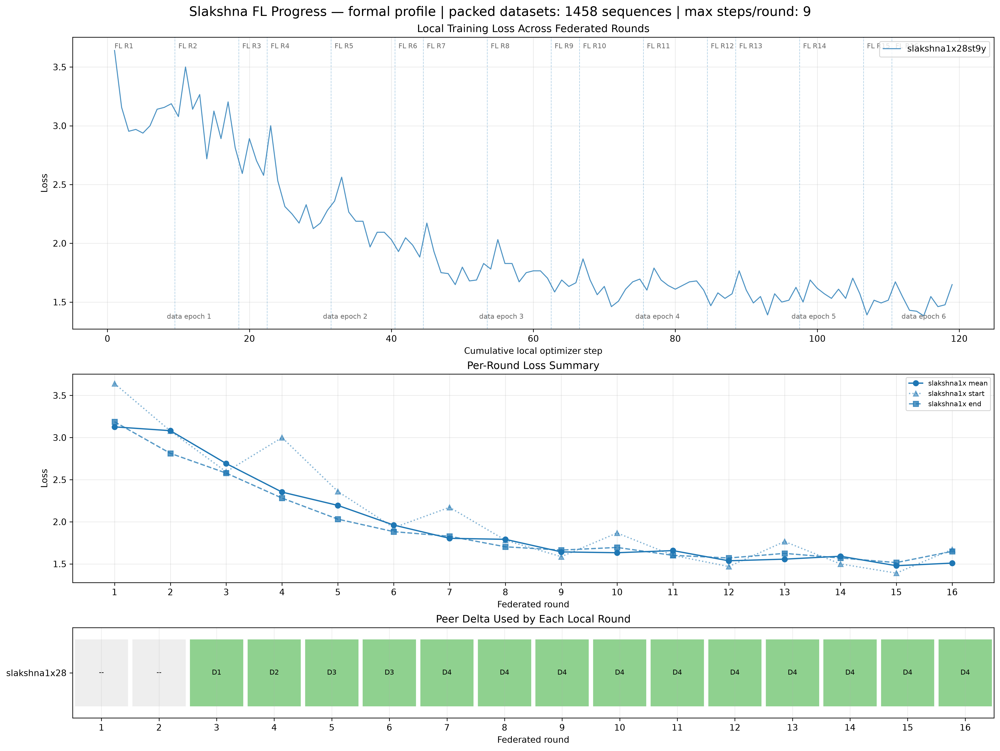
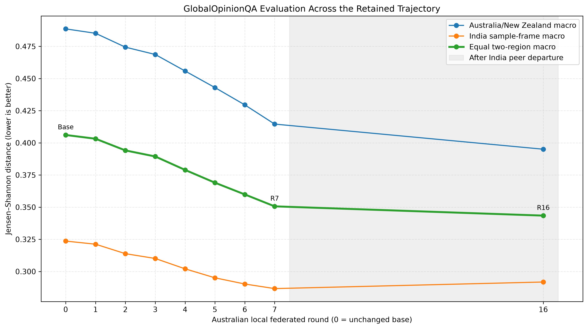

# M0 Third Cross-Country Federated Training Report

**Reporting date:** 31 August 2026

**Scope:** Australia–India federated fine-tuning of OLMo 2 7B, including the peer-disconnection event, local loss and data progress, merge history, and GlobalOpinionQA evaluation

## Summary

This run completed all 16 configured federated rounds on the Australian observer. The two sites were connected during Rounds 1–7, and four distinct Indian model updates were received. The Indian peer left the gossip mesh at 00:15:44 local time, shortly after the Australian Round 7 training and D4 merge had completed. Rounds 8–16 then continued locally while Slakshna repeatedly loaded the last available Indian update, D4. Round 7 is therefore the last checkpoint that represents an active two-site federation; later checkpoints are useful for studying post-disconnection drift but should not be presented as fresh cross-country aggregation.

The updated training path preserved the data cursor across federated rounds. Five data epochs were completed over Rounds 1–15, and Round 16 processed 39.5% of the sixth pass. Local mean loss declined from 3.1267 in Round 1 to 1.5096 in Round 16. On GlobalOpinionQA, the primary equal two-region Jensen–Shannon distance improved from 0.406107 for the base model to 0.350638 at Round 7, a 13.66% relative reduction. Round 16 reached 0.343434 overall, but its gain after Round 7 came from further Australia/New Zealand improvement while the India metric slightly regressed.

## Experimental setting

The run used Slakshna revision `73602b8` and Bhaskera revision `75a2698` from the `Slakshna` branch. Each federated round launched a two-worker FSDP Bhaskera job. The Australian site trained on the packed Australia/New Zealand M0 view; the Indian site managed its own data and runtime independently.

| Item | Australian-site setting |
|---|---|
| Base model | `allenai/OLMo-2-1124-7B` |
| Tokenizer / chat template | `allenai/OLMo-2-1124-7B-Instruct` |
| Adaptation | LoRA on `q_proj` and `v_proj` |
| LoRA rank / alpha / dropout | 16 / 64 / 0.03 |
| Precision / distributed strategy | BF16 / two-worker FSDP |
| Optimizer | 8-bit Muon |
| Learning rate / warmup | `3e-4` / 0 steps |
| Per-worker batch / gradient accumulation | 8 / 4 |
| Site-effective batch | 64 packed sequences per optimizer step |
| Maximum local steps per FL round | 9 |
| Sequence length / packing | 2,048 / enabled |
| Packed Australian dataset | 1,458 sequences |
| Training labels | Assistant responses only |
| Federation clock / sync deadline | 300 s / 300 s |
| Configured federated rounds | 16 |
| Delta transport | Top-10% sparsity, symmetric INT8 |
| Typical encoded model update | Approximately 5.43 MiB |

The Australian process started at 23:07:23 on 30 August and shut down normally after reaching Round 16 at 01:46:28 on 31 August. Total observer-side wall time was approximately 2 hours 39 minutes.

## Training, merge, and data-epoch record

Figure 1 was produced from the external Slakshna observation tool. The top panel concatenates optimizer-step losses while retaining FL-round and data-epoch boundaries. The middle panel summarizes start, mean, and end loss for each round. The bottom panel records the peer delta loaded by each round.

The data cursor now continues across Slakshna invocations. A complete pass consists of 22 optimizer steps distributed as 9 + 9 + 4 steps over three FL rounds. With a site-effective batch of 64, each pass consumes 1,408 of the 1,458 packed sequences. The final 50-sequence tail cannot form another complete distributed optimizer update and is dropped. Thus the run completed five real cursor passes and entered a sixth; the 16 federated rounds are not 16 data epochs.

| Data epoch | FL rounds | Optimizer steps | Consumed sequences | Completion / progress |
|---:|---|---:|---:|---|
| 1 | R1–R3 | 22 | 1,408 | Complete |
| 2 | R4–R6 | 22 | 1,408 | Complete |
| 3 | R7–R9 | 22 | 1,408 | Complete |
| 4 | R10–R12 | 22 | 1,408 | Complete |
| 5 | R13–R15 | 22 | 1,408 | Complete |
| 6 | R16 | 9 | 576 | 39.5% of the dataset cursor |

The loss trajectory falls rapidly over the first two data epochs and then settles near 1.5–1.7. The apparent rises at Rounds 4, 7, 10, 13, and 16 coincide with the start of a new data pass rather than a loss of training state. Selected round summaries are shown below; the full 16-round record is retained with the figure assets.

| Round | Steps | Start loss | Mean loss | End loss | Peer delta |
|---:|---:|---:|---:|---:|---|
| 1 | 9 | 3.6406 | 3.1267 | 3.1875 | None |
| 3 | 4 | 2.5938 | 2.6914 | 2.5781 | D1 |
| 6 | 4 | 1.9297 | 1.9609 | 1.8828 | D3 reused |
| **7** | 9 | 2.1719 | 1.8038 | 1.8281 | **D4, last active-peer round** |
| 9 | 4 | 1.5859 | 1.6426 | 1.6641 | D4 reused after departure |
| 12 | 4 | 1.4688 | 1.5371 | 1.5703 | D4 reused after departure |
| 15 | 4 | 1.3906 | 1.4785 | 1.5156 | D4 reused after departure |
| 16 | 9 | 1.6719 | 1.5096 | 1.6484 | D4 reused after departure |

Four distinct Indian deltas arrived. D1 was first used in Round 3, D2 in Round 4, D3 in Rounds 5–6, and D4 in Round 7. No new Indian model update arrived after D4. The peer left at 00:15:44, between Rounds 7 and 8, but the persisted D4 file remained available and was loaded again in every subsequent round.

| Australian rounds | Delta used | Interpretation |
|---|---|---|
| R1–R2 | None | Australian local training before the first remote update was available |
| R3 | D1 | First distinct Indian update |
| R4 | D2 | Second distinct Indian update |
| R5 | D3 | Third distinct Indian update |
| R6 | D3 | Same update reused; D4 arrived later in the round |
| R7 | D4 | Fourth and final distinct Indian update; last active-peer checkpoint |
| R8–R16 | D4 | Stale update repeatedly loaded after the Indian peer departed |

## GlobalOpinionQA evaluation

Evaluation used the standalone shared GOQA package and directly loaded the base model plus LoRA adapters. The dataset contains 1,106 questions with at least one Australia, New Zealand, or Indian human distribution. Five deterministic option-order prompts were evaluated per question. The score is Jensen–Shannon distance between the model option distribution and the available human distribution; lower is better. The evaluation covered 626 Australia pairs, 273 New Zealand pairs, and 932 Indian sample-frame pairs.

| Model state | Delta | Australia/NZ JSD | India JSD | Equal two-region JSD | Relative change vs base |
|---|---|---:|---:|---:|---:|
| Base | None | 0.488578 | 0.323637 | 0.406107 | — |
| Round 1 | None | 0.485151 | 0.321212 | 0.403182 | −0.72% |
| Round 2 | None | 0.474369 | 0.313851 | 0.394110 | −2.95% |
| Round 3 | D1 | 0.468686 | 0.310113 | 0.389400 | −4.11% |
| Round 4 | D2 | 0.455833 | 0.302070 | 0.378951 | −6.69% |
| Round 5 | D3 | 0.442958 | 0.295083 | 0.369021 | −9.13% |
| Round 6 | D3 | 0.429509 | 0.290274 | 0.359891 | −11.38% |
| **Round 7** | **D4** | **0.414574** | **0.286702** | **0.350638** | **−13.66%** |
| Round 16 | D4 reused | 0.395048 | 0.291820 | 0.343434 | −15.43% |

The primary metric improves monotonically across every evaluated state. Round 7 is the best defensible cross-country checkpoint because it is the last state produced while the Indian peer was present and it includes the final distinct Indian delta. Relative to base, Round 7 improves Australia/New Zealand JSD by 15.15%, India JSD by 11.41%, and the equal two-region score by 13.66%.

Round 16 has the numerically lowest two-region score, but it is not a better federated checkpoint in the same sense. From Round 7 to Round 16, Australia/New Zealand improves from 0.414574 to 0.395048, whereas India worsens from 0.286702 to 0.291820. This is consistent with continued Australian local adaptation and repeated use of stale D4 after the remote site had stopped contributing.

## Findings and limitations

The run confirms that the revised data path can preserve its cursor across FL rounds and complete multiple real data passes. It also produced 16 durable Australian adapters and a stable, strongly decreasing loss curve. The first seven rounds contain four distinct cross-country updates, and their GOQA trajectory improves on both regional views.

The main remaining issue is peer-liveness handling. Slakshna continued to count the persisted remote record toward the expected participant set and repeatedly loaded D4 after the peer left. The runtime therefore completed successfully from the local process's perspective, but Rounds 8–16 did not contain fresh Indian contributions. A future formal run should stop, pause, or explicitly mark the federation degraded when no new peer update is observed, and should identify updates by immutable source round or hash so that repeated use is visible without post-hoc log reconstruction.

## Conclusion

This session completed five full data epochs plus 39.5% of a sixth and demonstrated clear optimization progress. Round 7 is the recommended federated checkpoint: it is the last checkpoint before peer departure, incorporates D4, and reduces the primary GOQA distance by 13.66% relative to base. Round 16 is useful as a post-disconnection comparison, but its lower aggregate JSD reflects continued Australian training with a stale Indian update and is accompanied by a small regression on the India-specific metric.
